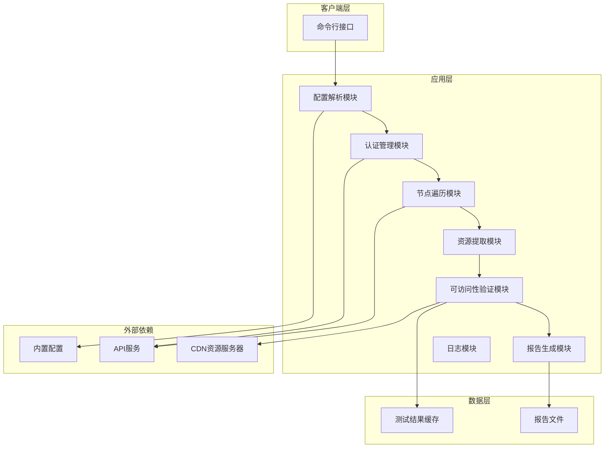
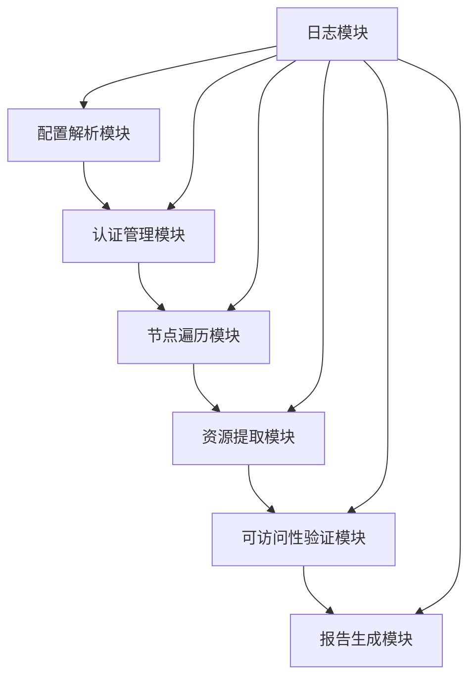
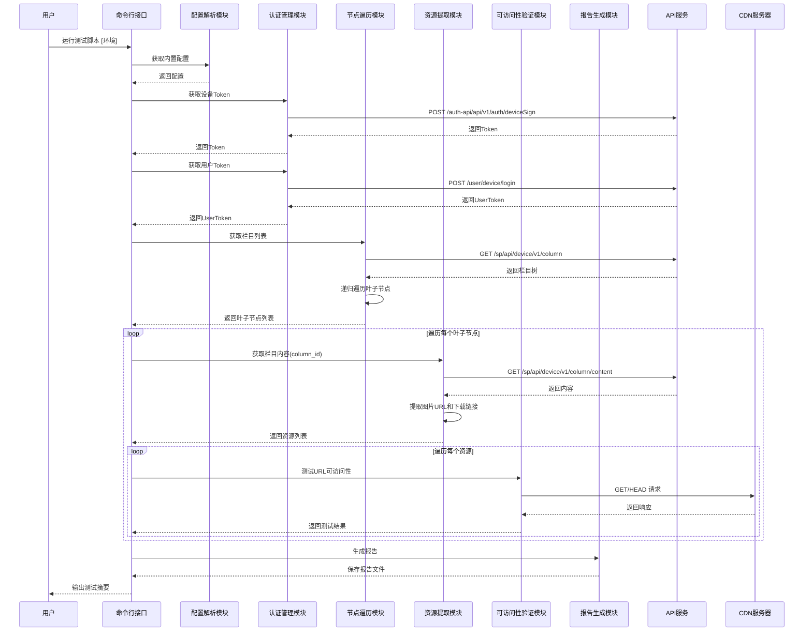
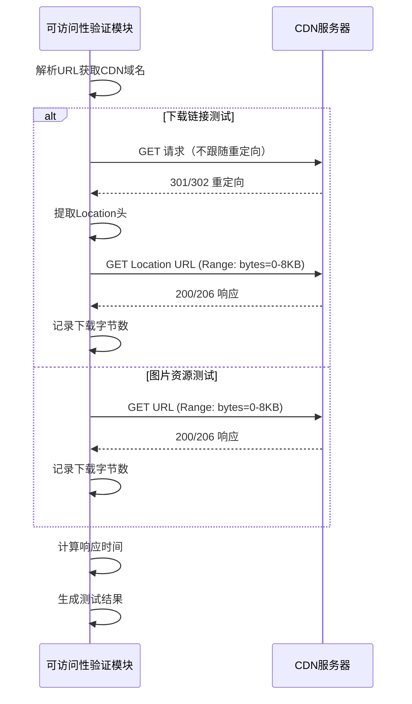
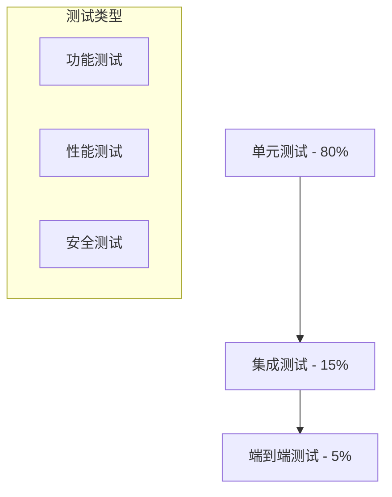

# CDN可访问性测试工具 - 架构设计文档

**文档版本**: v1.0  
**创建日期**: 2026-05-01  
**文档状态**: 已批准  
**目标读者**: 技术团队、产品团队、测试团队  
**评审类型**: 技术架构评审  

## 执行摘要

本项目设计一个CDN可访问性测试工具，通过内置配置获取API参数，递归遍历栏目树形结构，提取并验证所有图片资源和APK下载链接的可访问性，输出包含完整页面路径的测试报告。采用模块化设计，分为配置解析、认证管理、节点遍历、资源提取、可访问性验证和报告生成六个核心模块，确保代码清晰、可维护、可扩展。

## 1. 业务需求

### 1.1 业务背景

**现状分析**:
- 现有CDN测试工具覆盖范围有限，无法100%遍历页面所有节点
- 测试报告缺乏页面路径追溯信息，问题定位困难
- 需要验证页面展示的所有图片和APK下载链接

**核心问题**:
1. 测试覆盖不完整 - 无法确保所有资源都被测试
2. 问题定位困难 - 缺少资源的页面路径信息
3. 效率待提升 - 需要自动化完整测试流程

**解决方案**:
- 解析HTML配置文件获取环境参数
- 递归遍历栏目树形结构，100%覆盖所有叶子节点
- 提取每个资源的完整页面路径
- 生成可追溯的测试报告

### 1.2 使用场景

1. **完整节点遍历测试** - 测试工程师运行脚本，100%遍历所有栏目节点
2. **资源可访问性验证** - 验证所有图片和APK下载链接是否可访问
3. **可追溯报告生成** - 生成包含页面路径的Markdown报告
4. **多环境切换测试** - 通过命令行参数切换prod/acc/dev环境

### 1.3 核心需求

**功能需求**:
- 管理内置的多环境API配置（FR-001）
- 获取认证Token（FR-002）
- 递归遍历栏目树形结构（FR-003）
- 提取图片URL和下载链接（FR-004）
- 验证URL可访问性（FR-005）
- 记录完整页面路径（FR-006）
- 生成Markdown报告（FR-007）

**质量属性**:
- **性能**: 单环境测试时间<10分钟
- **可用性**: 脚本可用性>99%
- **可维护性**: 代码结构清晰，有单元测试

### 1.4 约束条件

- API调用频率限制（需设置请求间隔）
- 网络延迟影响测试执行时间
- HTML配置格式依赖

## 2. 架构设计

### 2.1 设计原则和技术选型

**架构原则**:
1. **模块化设计** - 每个模块职责单一，便于维护和扩展
2. **可扩展性** - 支持新增环境和资源类型
3. **健壮性** - 具备重试机制和错误处理
4. **可测试性** - 关键函数可独立测试

**核心技术选型**:

| 组件 | 选型 | 理由 |
|------|------|------|
| 语言 | Python 3.8+ | 简洁优雅，丰富的HTTP库支持 |
| HTTP库 | requests | 成熟稳定，支持HTTPS和重试 |
| HTML解析 | re + json | HTML中配置以JS变量形式存在，使用正则提取后解析JSON |
| 报告格式 | Markdown | 易读性好，便于版本控制 |

### 2.2 系统架构



### 2.3 模块依赖分析

#### 2.3.1 依赖关系图



#### 2.3.2 关键依赖分析

| 模块 | 依赖组件 | 影响级别 | 降级策略 | 熔断机制 |
|------|----------|----------|----------|----------|
| 配置解析 | 内置配置 | 高 | 使用默认环境配置 | 无 |
| 认证管理 | API服务 | 高 | 重试3次，记录错误后退出 | 重试失败后停止执行 |
| 节点遍历 | API服务 | 高 | 跳过失败节点，继续其他节点 | 单个节点失败不影响整体 |
| 可访问性验证 | CDN服务器 | 中 | 记录失败，继续测试其他资源 | 单个资源失败不影响整体 |

#### 2.3.3 弹性设计

- **超时机制**: 每个HTTP请求超时时间30秒
- **重试策略**: 认证请求重试3次，指数退避延迟
- **容错机制**: 单个节点/资源失败不中断整体测试流程

### 2.4 模块设计

#### 2.4.1 配置解析模块

**职责边界**:
- 管理内置的多环境配置（prod/acc/dev）
- 提供统一的配置获取接口

**接口设计**:

```python
class ConfigParser:
    def __init__(self, environment: str = 'prod'):
        """初始化配置解析器"""
    
    def get_config(self) -> dict:
        """获取当前环境的配置"""
    
    def get_api_base_url(self) -> str:
        """获取API基础URL"""
    
    def get_access_key(self) -> str:
        """获取访问密钥"""
    
    def get_secret_key(self) -> str:
        """获取签名密钥"""
    
    def get_default_params(self) -> dict:
        """获取默认设备参数"""
```

**配置结构**:

| 配置项 | 类型 | 说明 |
|--------|------|------|
| API_BASE_URL | str | API服务器地址 |
| ACCESS_KEY | str | 访问密钥 |
| SECRET_KEY | str | 签名密钥 |
| DEFAULT_PARAMS | dict | 设备参数（productId, brandId等） |

#### 2.4.2 认证管理模块

**职责边界**:
- 获取设备Token
- 获取用户Token
- 管理Token生命周期

**接口设计**:

```python
class AuthManager:
    def __init__(self, config: dict):
        """初始化认证管理器"""
    
    def get_device_token(self) -> str:
        """获取设备认证Token"""
    
    def get_user_token(self) -> str:
        """获取用户Token"""
    
    def generate_auth_header(self, path: str) -> str:
        """生成Authorization请求头"""
```

#### 2.4.3 节点遍历模块

**职责边界**:
- 获取栏目树形结构
- 递归遍历所有叶子节点
- 记录节点完整路径

**接口设计**:

```python
class NodeTraverser:
    def __init__(self, config: dict, token: str):
        """初始化节点遍历器"""
    
    def get_columns(self) -> list:
        """获取栏目列表"""
    
    def traverse_nodes(self, nodes: list, parent_path: str = "") -> list:
        """递归遍历节点，返回叶子节点列表"""
    
    def get_leaf_nodes(self) -> list:
        """获取所有叶子节点及其路径"""
```

**叶子节点数据结构**:

| 字段 | 类型 | 说明 |
|------|------|------|
| id | str | 节点ID |
| name | str | 节点名称 |
| path | str | 完整页面路径 |

#### 2.4.4 资源提取模块

**职责边界**:
- 获取栏目内容
- 提取图片URL（icon、poster、cover、background）
- 提取APK下载链接

**接口设计**:

```python
class ResourceExtractor:
    def __init__(self, config: dict, token: str):
        """初始化资源提取器"""
    
    def get_column_content(self, column_id: str) -> dict:
        """获取栏目内容"""
    
    def extract_image_urls(self, content: dict, node_path: str) -> list:
        """提取图片URL列表"""
    
    def extract_download_links(self, content: dict, node_path: str) -> list:
        """提取APK下载链接列表"""
```

**资源数据结构**:

| 字段 | 类型 | 说明 |
|------|------|------|
| url | str | 资源URL |
| field | str | 字段名称（icon/poster等） |
| page_path | str | 页面路径 |
| vs_id | str | 应用ID（下载链接专用） |

#### 2.4.5 可访问性验证模块

**职责边界**:
- 验证URL可访问性
- 记录HTTP状态码、下载字节数、响应时间
- 处理超时和重试

**接口设计**:

```python
class AccessibilityTester:
    def __init__(self):
        """初始化可访问性测试器"""
    
    def test_url(self, url: str, test_type: str = 'icon', page_path: str = "", vs_id: str = None) -> dict:
        """测试单个URL的可访问性"""
    
    def batch_test(self, resources: list) -> list:
        """批量测试资源列表"""
```

**测试结果数据结构**:

| 字段 | 类型 | 说明 |
|------|------|------|
| url | str | 测试的URL |
| test_type | str | 测试类型（icon/download） |
| page_path | str | 页面路径 |
| vs_id | str | 应用ID |
| status | str | 测试状态（PASS/FAIL） |
| http_status | int | HTTP状态码 |
| downloaded_bytes | int | 下载字节数 |
| response_time | float | 响应时间（秒） |
| cdn_domain | str | CDN域名 |
| error_message | str | 错误信息 |

#### 2.4.6 报告生成模块

**职责边界**:
- 汇总测试结果
- 生成Markdown格式报告
- 包含CDN域名统计

**接口设计**:

```python
class ReportGenerator:
    def __init__(self, environment: str):
        """初始化报告生成器"""
    
    def generate(self, results: list) -> str:
        """生成Markdown报告内容"""
    
    def save_report(self, results: list, filename: str = None) -> str:
        """保存报告到文件"""
```

## 3. 核心业务流程

### 3.1 完整测试流程 - P0



### 3.2 可访问性验证流程 - P0



### 3.3 异常处理流程

| 异常场景 | 检测方式 | 处理策略 | 恢复机制 |
|----------|----------|----------|----------|
| HTML文件不存在 | 文件读取异常 | 使用内置默认配置 | 提示用户检查路径 |
| Token获取失败 | API返回错误码 | 重试3次后退出 | 提示用户检查配置 |
| 栏目API调用失败 | API返回错误码 | 跳过该节点继续 | 记录错误日志 |
| URL验证超时 | requests超时异常 | 标记FAIL，记录错误 | 继续测试其他资源 |
| HTTP状态码非200 | 检查响应状态码 | 标记FAIL，记录状态码 | 继续测试其他资源 |

## 4. 数据架构设计

### 4.1 数据模型

**测试结果模型**:

```python
# 测试结果数据结构
test_result = {
    'url': str,                    # 测试的URL
    'test_type': str,              # 测试类型: 'icon' | 'download'
    'page_path': str,              # 页面路径: '栏目1/子栏目1/叶子栏目'
    'vs_id': str,                  # 应用ID（下载链接专用）
    'status': str,                 # 状态: 'PASS' | 'FAIL'
    'http_status': int,            # HTTP状态码
    'downloaded_bytes': int,       # 下载字节数
    'response_time': float,        # 响应时间(秒)
    'cdn_domain': str,             # CDN域名
    'error_message': str           # 错误信息
}
```

**节点路径模型**:

```python
# 叶子节点数据结构
leaf_node = {
    'id': str,                     # 节点ID
    'name': str,                   # 节点名称
    'path': str                    # 完整路径
}
```

**CDN统计模型**:

```python
# CDN域名统计
cdn_stat = {
    'domain': str,                 # CDN域名
    'pass_count': int,             # 通过次数
    'fail_count': int              # 失败次数
}
```

### 4.2 缓存策略

| 数据类型 | 缓存时间 | 更新策略 | 缓存位置 |
|----------|----------|----------|----------|
| Token | 测试期间 | 测试开始时获取 | 内存 |
| 栏目树 | 测试期间 | 测试开始时获取 | 内存 |
| 测试结果 | 测试期间 | 实时更新 | 内存 |

## 5. 性能与容量规划

### 5.1 性能目标

| 指标类别 | 具体指标 | 目标值 | 测量方法 | 监控阈值 |
|----------|----------|--------|----------|----------|
| 响应时间 | 单个URL验证 | < 5s | 记录响应时间 | > 10s告警 |
| 吞吐量 | 批量验证 | > 20 URLs/min | 统计每分钟验证数 | < 10 URLs/min告警 |
| 总执行时间 | 单环境测试 | < 10分钟 | 记录开始到结束时间 | > 15分钟告警 |

### 5.2 容量规划

**当前规模**:
- 每环境约100-200个栏目节点
- 每节点约5-10个资源
- 每环境约500-2000个资源

**扩展规模**:
- 支持3个环境（prod/acc/dev）
- 支持并行测试（未来扩展）

### 5.3 性能优化策略

1. **请求间隔控制**
   - 每次请求间隔0.2-0.5秒，避免触发API限流
   - 下载链接测试间隔0.5秒

2. **批量处理优化**
   - 使用session复用TCP连接
   - 支持并发请求（未来扩展）

3. **数据处理优化**
   - 流式处理响应，不完整下载
   - 只下载前8KB验证可访问性

## 6. 部署与运维

### 6.1 环境架构

| 环境类型 | 用途 | 配置规格 | 数据隔离策略 |
|----------|------|----------|--------------|
| 开发环境 | 开发测试 | Python 3.8+ | 独立配置文件 |
| 测试环境 | 功能验证 | Python 3.8+ | 独立配置文件 |
| 生产环境 | 日常测试 | Python 3.8+ | 独立配置文件 |

### 6.2 依赖管理

**依赖清单**:

| 依赖 | 版本 | 用途 |
|------|------|------|
| requests | >=2.28.0 | HTTP请求 |
| urllib3 | >=1.26.0 | HTTP库底层支持 |

**安装命令**:
```bash
pip install -r requirements.txt
```

### 6.3 执行方式

**命令格式**:
```bash
python cdn_accessibility_full_tester.py [prod|acc|dev]
```

**参数说明**:
- `prod`: 生产环境（默认）
- `acc`: 验收环境
- `dev`: 开发环境

## 7. 监控与告警

### 7.1 日志规范

| 日志类型 | 记录内容 | 日志级别 | 输出位置 |
|----------|----------|----------|----------|
| 信息日志 | 测试进度、步骤开始/结束 | INFO | 控制台 |
| 警告日志 | 单个资源测试失败 | WARN | 控制台+报告 |
| 错误日志 | API调用失败、配置错误 | ERROR | 控制台+报告 |

### 7.2 告警策略

| 告警级别 | 触发条件 | 通知方式 | 响应时间 |
|----------|----------|----------|----------|
| 错误 | Token获取失败 | 控制台输出 | 立即 |
| 警告 | 测试失败率>10% | 控制台输出 | 测试结束 |

## 8. 安全架构设计

### 8.1 安全控制矩阵

| 安全层面 | 威胁类型 | 控制措施 | 验证方法 |
|----------|----------|----------|----------|
| 密钥保护 | 密钥泄露 | 不在日志中输出完整密钥 | 检查日志内容 |
| 数据传输 | 中间人攻击 | 使用HTTPS加密传输 | 验证URL协议 |
| 请求安全 | 请求伪造 | 使用HMAC签名认证 | 验证签名机制 |
| 资源访问 | 未授权访问 | 设备认证Token | 验证Token有效性 |

### 8.2 安全漏洞防护

| 漏洞类型 | 防护措施 | 检测方法 |
|----------|----------|----------|
| 注入攻击 | 使用参数化请求 | 代码审查 |
| 敏感信息泄露 | 日志脱敏处理 | 日志审查 |
| 拒绝服务 | 请求间隔控制 | 性能监控 |

## 9. 测试策略

### 9.1 测试分层



### 9.2 测试场景覆盖

| 测试类型 | 覆盖场景 | 测试工具 | 通过标准 |
|----------|----------|----------|----------|
| 单元测试 | 配置解析、认证、资源提取 | pytest | 所有测试用例通过 |
| 集成测试 | API调用、完整流程 | pytest | 流程正常执行 |
| 端到端测试 | 完整测试流程 | pytest | 报告生成正常 |

### 9.3 关键业务路径测试

| 业务路径 | 测试用例 | 验收标准 | 自动化程度 |
|----------|----------|----------|------------|
| 配置解析 | 获取内置配置 | 正确返回配置项 | 自动化 |
| 认证获取 | 获取Token | Token非空且有效 | 自动化 |
| 节点遍历 | 遍历栏目树 | 返回所有叶子节点 | 自动化 |
| 资源验证 | 验证有效/无效URL | 正确判断可访问性 | 自动化 |
| 报告生成 | 生成报告 | 报告格式正确 | 自动化 |

## 10. 实施计划

### 10.1 项目里程碑

| 阶段 | 时间周期 | 主要交付物 | 验收标准 | 关键风险 |
|------|----------|------------|----------|----------|
| 需求分析 | 2026-05-01 ~ 2026-05-05 | 需求分析文档 | 文档评审通过 | 需求理解偏差 |
| 架构设计 | 2026-05-06 ~ 2026-05-08 | 架构设计文档 | 文档评审通过 | 技术选型风险 |
| 功能开发 | 2026-05-09 ~ 2026-05-12 | 测试脚本代码 | 单元测试通过 | 代码质量 |
| 测试验证 | 2026-05-13 ~ 2026-05-14 | 测试报告 | 功能验收通过 | 测试覆盖 |
| 上线交付 | 2026-05-15 | 交付文档 | 验收通过 | 部署问题 |

### 10.2 团队配置

| 角色 | 人数 | 主要职责 | 技能要求 |
|------|------|----------|----------|
| 开发工程师 | 1 | 代码实现、单元测试 | Python、HTTP请求 |
| 测试工程师 | 1 | 功能测试、验收 | 测试方法、CDN知识 |
| 技术负责人 | 1 | 架构设计、评审 | 架构设计、代码审查 |

## 11. 风险评估与缓解

### 11.1 技术风险

| 风险项 | 影响程度 | 发生概率 | 风险等级 | 缓解措施 |
|--------|----------|----------|----------|----------|
| 配置变更 | 高 | 低 | 中 | 使用版本控制管理配置变更 |
| API限流 | 高 | 中 | 中 | 设置请求间隔，增加重试机制 |
| 网络超时 | 中 | 中 | 中 | 设置超时时间，增加重试 |

### 11.2 业务风险

| 风险项 | 影响程度 | 发生概率 | 风险等级 | 缓解措施 |
|--------|----------|----------|----------|----------|
| 测试覆盖不完整 | 高 | 低 | 中 | 遍历算法验证，确保100%覆盖 |
| 报告信息不足 | 中 | 低 | 低 | 报告模板评审，确保信息完整 |

## 12. 附录

### 12.1 技术术语表

| 术语 | 定义 |
|------|------|
| CDN | 内容分发网络 |
| Token | 认证令牌 |
| 栏目节点 | 内容分类节点 |
| 叶子节点 | 没有子节点的节点 |
| 页面路径 | 从根到叶子的完整路径 |

### 12.2 参考文档

1. ai-coding-workflow.md - D:\projects\data-preview\docs\standards\design\ai-coding-workflow.md
2. requirements-analysis.md - D:\projects\data-preview\data-test\cdn-test\requirements-analysis.md

### 12.3 变更记录

| 版本 | 日期 | 变更内容 | 变更人 |
|------|------|----------|--------|
| v1.0 | 2026-05-01 | 初始版本 | 开发团队 |

---

**文档状态**: 已批准  
**下次评审**: 2026-05-15  
**批准人**: 技术负责人