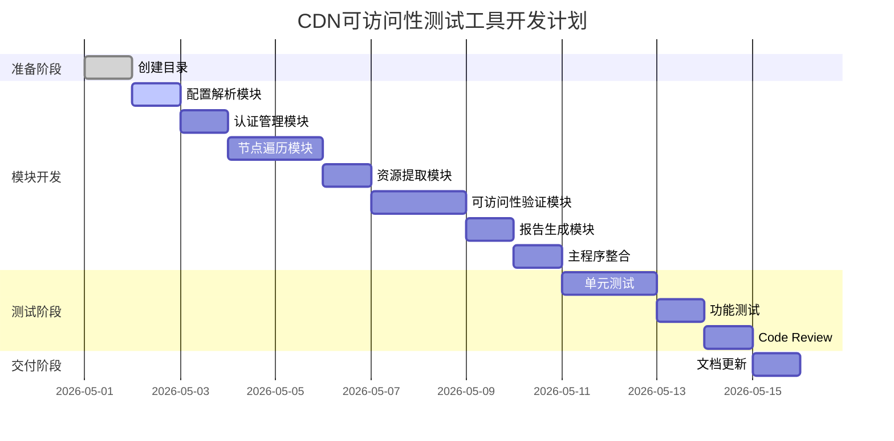

# CDN可访问性测试工具 - 开发计划文档

**文档版本**: v1.0  
**创建日期**: 2026-05-01  
**文档状态**: 已批准  
**目标读者**: 开发团队、测试团队、技术负责人  

---

## 1. 项目概述

### 1.1 项目背景

本项目旨在开发一个CDN可访问性测试工具，能够100%遍历OS10-prod-QA.html页面的所有栏目节点，提取并验证所有图片资源和APK下载链接的可访问性，输出包含完整页面路径的测试报告。

### 1.2 项目目标

| 目标编号 | 目标描述 | 完成标准 |
|----------|----------|----------|
| TG1 | 实现100%页面节点遍历 | 遍历所有叶子节点，覆盖率100% |
| TG2 | 验证所有资源可访问性 | 图片和下载链接验证通过 |
| TG3 | 生成可追溯报告 | 报告包含完整页面路径 |
| TG4 | 支持多环境测试 | 支持prod/acc/dev切换 |

### 1.3 项目范围

**范围内**:
- 配置解析模块
- 认证管理模块
- 节点遍历模块
- 资源提取模块
- 可访问性验证模块
- 报告生成模块
- 单元测试

**范围外**:
- UI自动化测试
- 视频播放测试
- 定时任务功能

---

## 2. 任务拆解

### 2.1 任务分解矩阵

| 任务ID | 任务描述 | 模块 | 优先级 | 预估工时 | 状态 |
|--------|----------|------|--------|----------|------|
| T001 | 创建项目目录结构 | 项目管理 | P2 | 0.5h | ✅ |
| T002 | 配置解析模块实现 | 配置解析 | P0 | 2h | ⏳ |
| T003 | 认证管理模块实现 | 认证管理 | P0 | 2h | ⏳ |
| T004 | 节点遍历模块实现 | 节点遍历 | P0 | 3h | ⏳ |
| T005 | 资源提取模块实现 | 资源提取 | P0 | 2h | ⏳ |
| T006 | 可访问性验证模块实现 | 可访问性验证 | P0 | 3h | ⏳ |
| T007 | 报告生成模块实现 | 报告生成 | P0 | 2h | ⏳ |
| T008 | 主程序整合 | 主程序 | P0 | 1h | ⏳ |
| T009 | 单元测试编写 | 测试 | P1 | 4h | ⏳ |
| T010 | 功能测试验证 | 测试 | P1 | 2h | ⏳ |
| T011 | Code Review | 质量保证 | P1 | 1h | ⏳ |
| T012 | 文档更新 | 文档 | P2 | 1h | ⏳ |

### 2.2 任务详细说明

#### T001: 创建项目目录结构

**描述**: 创建项目基础目录结构

**依赖**: 无

**输出**:
- `data-test/cdn-test/` 目录
- `data-test/cdn-test/unit-tests/` 目录

---

#### T002: 配置解析模块实现

**描述**: 实现内置的多环境配置管理功能

**依赖**: T001

**输入**:
- 环境参数（prod/acc/dev）

**输出**:
- `config_parser.py` 模块
- 配置解析类

**验收标准**:
- 正确返回API_BASE_URL、ACCESS_KEY、SECRET_KEY
- 正确返回DEFAULT_PARAMS
- 支持prod/acc/dev三种环境

---

#### T003: 认证管理模块实现

**描述**: 实现Token获取和管理功能

**依赖**: T002

**输入**:
- 配置信息

**输出**:
- `auth_manager.py` 模块
- 认证管理类

**验收标准**:
- 成功获取设备Token
- 成功获取用户Token
- 正确生成Authorization请求头

---

#### T004: 节点遍历模块实现

**描述**: 实现栏目树形结构遍历功能

**依赖**: T003

**输入**:
- Token
- 栏目API响应

**输出**:
- `node_traverser.py` 模块
- 节点遍历类

**验收标准**:
- 递归遍历所有叶子节点
- 记录每个节点的完整路径
- 返回叶子节点列表

---

#### T005: 资源提取模块实现

**描述**: 实现从栏目内容提取资源URL的功能

**依赖**: T004

**输入**:
- Token
- 栏目ID

**输出**:
- `resource_extractor.py` 模块
- 资源提取类

**验收标准**:
- 提取icon、poster、cover、background字段
- 提取APK下载链接
- 记录每个资源的页面路径

---

#### T006: 可访问性验证模块实现

**描述**: 实现URL可访问性验证功能

**依赖**: T005

**输入**:
- URL列表
- 测试类型

**输出**:
- `accessibility_tester.py` 模块
- 可访问性测试类

**验收标准**:
- 验证HTTP状态码
- 记录下载字节数和响应时间
- 支持重试机制

---

#### T007: 报告生成模块实现

**描述**: 实现Markdown报告生成功能

**依赖**: T006

**输入**:
- 测试结果列表

**输出**:
- `report_generator.py` 模块
- 报告生成类

**验收标准**:
- 生成完整的Markdown报告
- 包含摘要、详细结果、CDN统计
- 包含完整页面路径

---

#### T008: 主程序整合

**描述**: 整合所有模块，实现完整测试流程

**依赖**: T002-T007

**输入**:
- 命令行参数

**输出**:
- `cdn_accessibility_full_tester.py` 主程序

**验收标准**:
- 支持命令行参数切换环境
- 完整执行测试流程
- 输出测试摘要

---

#### T009: 单元测试编写

**描述**: 编写单元测试用例

**依赖**: T002-T007

**输入**:
- 各模块代码

**输出**:
- `unit-tests/test_config_parser.py`
- `unit-tests/test_auth_manager.py`
- `unit-tests/test_node_traverser.py`
- `unit-tests/test_resource_extractor.py`
- `unit-tests/test_accessibility_tester.py`
- `unit-tests/test_report_generator.py`

**验收标准**:
- 单元测试覆盖率>80%
- 所有测试用例通过

---

#### T010: 功能测试验证

**描述**: 进行功能测试验证

**依赖**: T008

**输入**:
- 完整测试脚本

**输出**:
- 功能测试报告

**验收标准**:
- 所有P0场景验收标准通过
- 测试执行时间<10分钟

---

#### T011: Code Review

**描述**: 执行代码审查

**依赖**: T009

**输入**:
- 所有代码文件

**输出**:
- 代码审查报告

**验收标准**:
- 代码符合规范
- 无安全隐患
- 设计合理

---

#### T012: 文档更新

**描述**: 更新项目文档

**依赖**: T010-T011

**输入**:
- 需求分析文档
- 架构设计文档

**输出**:
- 更新后的文档

**验收标准**:
- 文档与代码一致
- 文档完整

---

## 3. 进度跟踪

### 3.1 甘特图

### 3.2 进度状态

| 阶段 | 开始时间 | 结束时间 | 状态 |
|------|----------|----------|------|
| 准备阶段 | 2026-05-01 | 2026-05-01 | ✅ 完成 |
| 模块开发 | 2026-05-02 | 2026-05-08 | ⏳ 进行中 |
| 测试阶段 | 2026-05-09 | 2026-05-12 | ⏳ 待开始 |
| 交付阶段 | 2026-05-13 | 2026-05-15 | ⏳ 待开始 |

### 3.3 里程碑检查

| 里程碑 | 日期 | 状态 | 验收标准 |
|--------|------|------|----------|
| 需求分析完成 | 2026-05-01 | ✅ | 需求文档评审通过 |
| 架构设计完成 | 2026-05-01 | ✅ | 架构文档评审通过 |
| 模块开发完成 | 2026-05-08 | ⏳ | 所有模块代码完成 |
| 测试完成 | 2026-05-12 | ⏳ | 单元测试通过，功能测试通过 |
| 交付完成 | 2026-05-15 | ⏳ | 文档更新完成，验收通过 |

---

## 4. 问题阻塞与风险

### 4.1 当前阻塞项

| 阻塞项 | 描述 | 影响 | 责任人 | 预计解决时间 |
|--------|------|------|--------|--------------|
| 无 | 暂无阻塞项 | 无 | - | - |

### 4.2 风险登记

| 风险编号 | 风险描述 | 影响程度 | 发生概率 | 缓解措施 | 状态 |
|----------|----------|----------|----------|----------|------|
| RISK-001 | 内置配置变更 | 高 | 低 | 使用版本控制管理配置变更 | 监控 |
| RISK-002 | API限流 | 高 | 中 | 设置请求间隔，增加重试机制 | 已实施 |
| RISK-003 | 网络超时 | 中 | 中 | 设置超时时间，增加重试 | 已实施 |

### 4.3 迭代变更记录

| 变更编号 | 变更描述 | 原因 | 影响评估 | 审批人 | 日期 |
|----------|----------|------|----------|--------|------|
| C001 | 无变更 | - | - | - | - |

---

## 5. 资源需求

### 5.1 人员配置

| 角色 | 人数 | 主要职责 | 参与阶段 |
|------|------|----------|----------|
| 开发工程师 | 1 | 代码实现、单元测试 | 模块开发、测试阶段 |
| 测试工程师 | 1 | 功能测试、验收 | 测试阶段 |
| 技术负责人 | 1 | 架构设计、代码审查 | 全阶段 |

### 5.2 环境需求

| 环境 | 用途 | 配置要求 |
|------|------|----------|
| 开发环境 | 代码开发 | Python 3.8+, requests库 |
| 测试环境 | 功能验证 | Python 3.8+, 网络访问API |
| 生产环境 | 日常测试 | Python 3.8+, 网络访问API |

### 5.3 工具链

| 工具 | 用途 | 版本要求 |
|------|------|----------|
| Python | 开发语言 | >=3.8 |
| requests | HTTP请求 | >=2.28.0 |
| pytest | 单元测试 | >=7.0.0 |

---

## 6. 交付物清单

| 交付物 | 描述 | 负责人 | 交付时间 |
|--------|------|--------|----------|
| cdn_accessibility_full_tester.py | 主测试脚本 | 开发工程师 | 2026-05-08 |
| config_parser.py | 配置解析模块 | 开发工程师 | 2026-05-02 |
| auth_manager.py | 认证管理模块 | 开发工程师 | 2026-05-03 |
| node_traverser.py | 节点遍历模块 | 开发工程师 | 2026-05-05 |
| resource_extractor.py | 资源提取模块 | 开发工程师 | 2026-05-06 |
| accessibility_tester.py | 可访问性验证模块 | 开发工程师 | 2026-05-07 |
| report_generator.py | 报告生成模块 | 开发工程师 | 2026-05-08 |
| unit-tests/ | 单元测试目录 | 开发工程师 | 2026-05-10 |
| requirements.txt | 依赖清单 | 开发工程师 | 2026-05-02 |

---

## 7. 质量保证

### 7.1 代码规范

- 遵循PEP8编码规范
- 使用类型注解
- 函数和类有清晰的文档字符串
- 代码结构清晰，模块化设计

### 7.2 测试标准

- 单元测试覆盖率>80%
- 所有单元测试用例通过
- 功能测试覆盖所有P0场景
- Code Review通过

### 7.3 文档标准

- 需求分析文档完整
- 架构设计文档完整
- 代码有必要的注释
- 文档与代码一致

---

**文档状态**: 已批准  
**下次更新**: 2026-05-08  
**更新人**: 开发团队