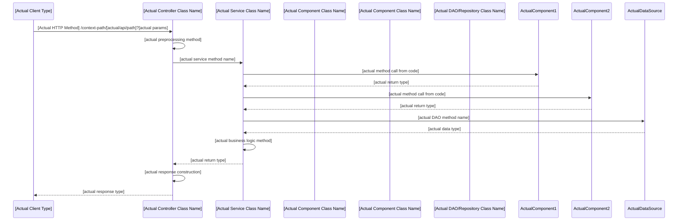

# [API Function Description] API

> **Documentation Storage Requirements**:
> - **MUST store API documentation in `docs/api/` directory**
> - Use kebab-case file naming following [NAMING-CONVENTIONS.md](NAMING-CONVENTIONS.md)
> - File structure: `docs/api/[api-name].md`
> - Example: `docs/api/device-group-data.md`, `docs/api/user-consent-management.md`
> 
> **Mixed Project Organization**:
> - **API Projects**: Store API documentation in `docs/api/`
> - **Task-based Projects**: Store task documentation in `docs/tasks/`
> - **Hybrid Projects**: Use both `docs/api/` and `docs/tasks/` directories as needed

> **Multi-Method Endpoint Documentation Strategy**:

> **Case 1: Different methods, different implementations** (Separate documents required)
>
> ```java
> @RequestMapping(value = "/api/endpoint", method = RequestMethod.GET)
> public APIResult getEndpoint() { ... }
>
> @RequestMapping(value = "/api/endpoint", method = RequestMethod.POST) 
> public APIResult postEndpoint() { ... }
> ```
>
> Create separate files: `endpoint-get.md`, `endpoint-post.md`
>
> **Case 2: Multiple methods, single implementation** (Single document)
>
> ```java
> @RequestMapping(method = {RequestMethod.GET, RequestMethod.POST})
> public APIResult handleEndpoint() { ... }
> ```
>
> Create single file: `endpoint.md` documenting both methods

## API Overview

**Endpoint**: `https://domain:port/context-path/[api/path]`  
**Method**: `[HTTP_METHOD]`  
**Function**: [Brief description of what this API does]

> **MANDATORY Endpoint Format Requirements**:
> - **MUST include complete URL**: `https://domain:port/context-path/api/path`
> - **MUST include context-path**: Never omit the application context path
> - **Context-path examples**: `/tou`, `/service_portal`, `/api/v1`, etc.
> - **Complete format**: `https://domain:port/{context-path}/{api-path}`
> - **Method**: HTTP method(s) - single method like `GET` or multiple methods like `GET, POST`
> 
> **Correct Examples**:
> - `https://domain:port/tou/device/update` ✓
> - `https://domain:port/tou/cmp/qrcode/generate` ✓
> - `https://domain:port/service_portal/api/status` ✓
> 
> **Incorrect Examples**:
> - `https://domain:port/device/update` ✗ (missing context-path)
> - `/device/update` ✗ (missing domain and context-path)
> - `device/update` ✗ (incomplete URL)

> **Documentation Priority**: If the controller method has comments describing the method's scenario and purpose, prioritize using those comments as the Function description in the API Overview section.

## API Documentation

For detailed API specifications including request parameters, response formats, and examples, please refer to:

**API DOC Platform**: [https://apidoc.zeasn.com/](https://apidoc.zeasn.com/)

## Core Logic

> **MANDATORY Deep Code Analysis Requirements**:
> - **MUST analyze actual controller method source code line by line**
> - **MUST trace all service method calls and examine their implementations**
> - **MUST review actual DAO/Repository method implementations and SQL queries**
> - **MUST understand actual response construction from source code**
> - **MUST document actual exception handling from try-catch blocks**
> - **MUST extract business rules from actual code logic, not assumptions**
> - **NO placeholder content allowed - all content must be derived from actual code**

### 1. Request Reception and Preprocessing

- [Description of how request is received]
- [Any preprocessing steps]
- [Parameter validation logic]

### 2. [Business Logic Step 1]

```java
[key_method_call]
```

- [Description of this step]
- [What it accomplishes]

### 3. [Business Logic Step 2] (Core Logic)

#### 3.1 [Sub-step 1]

```java
[code_example]
```

- [Detailed explanation]

#### 3.2 [Sub-step 2]

```java
[code_example]
```

- [Detailed explanation]

#### 3.3 [Sub-step 3]

- [Process description]
- [Data transformation logic]

### 4. [Final Processing Step]

```java
[final_processing_code]
```

- [Description of final processing]
- [Result preparation]

### 5. Response Construction

```java
[response_building_code]
```

- [How response is built]
- [Success/error handling]

## [Business Rule/Algorithm Name]

> **MANDATORY**: This section must be based on actual code analysis, not generic descriptions
> - **Extract rules from actual if/else conditions, switch statements, and business logic**
> - **Document actual algorithms found in the code implementation**
> - **Include actual method names and code snippets where rules are implemented**
> - **If no specific business rules exist in code, remove this section entirely**

[Only include if actual business rules/algorithms are found in code analysis]

1. **[Actual Rule from Code]**: [Description based on actual implementation]
2. **[Actual Algorithm from Code]**: [Description based on actual logic]
3. **[Actual Business Logic from Code]**: [Description based on actual conditions]

## Sequence Diagram

> **MANDATORY**: Sequence diagram must reflect actual code execution flow
> - **Trace actual method calls from controller through all layers**
> - **Use actual class names and method names from source code**
> - **Include actual service dependencies found in code**
> - **Show actual data access patterns from DAO/Repository implementations**
> - **Reflect actual exception handling and error flows**



## Data Flow

> **MANDATORY**: Data flow must represent actual data transformation in code
> - **Trace actual data objects through method calls**
> - **Document actual data transformations found in code**
> - **Include actual database queries and data sources**
> - **Show actual DTO/Model transformations**
> - **Reflect actual data processing logic from implementation**

```
[Actual Data Source/Database Table] ← [Actual query/method from DAO]
    ↓
[Actual DTO/Model Class] ← [Actual data mapping/transformation]
    ↓  
[Actual Service Processing] ← [Actual business logic methods]
    ↓
[Actual Response Object] ← [Actual APIResult/ObjectResult/ArrayResult construction]
```

## Business Logic Characteristics

1. **[Characteristic 1]**: [Description and benefits]
2. **[Characteristic 2]**: [Description and benefits]
3. **[Characteristic 3]**: [Description and benefits]
4. **[Characteristic 4]**: [Description and benefits]
5. **[Characteristic 5]**: [Description and benefits]

## Exception Handling

- **[Exception Type 1]**: [How it's handled and response]
- **[Exception Type 2]**: [How it's handled and response]
- **[Exception Type 3]**: [How it's handled and response]
- **[Exception Type 4]**: [How it's handled and response]

---

## Multi-Method Endpoint Documentation Guidelines

### Implementation-Based Documentation Strategy

**Case 1: Different Controller Methods (Separate Documents)**

```java
// Separate methods = Separate documents
@RequestMapping(value = "/user/tcmap", method = RequestMethod.GET)
public APIResult getTcMapByUserId(@RequestParam String userId) { ... }

@RequestMapping(value = "/user/tcmap", method = RequestMethod.POST)
public APIResult setTcMap(@RequestParam String userId, ...) { ... }
```

**Documentation**: Create `user-tcmap-get.md` and `user-tcmap-set.md`

**Case 2: Single Controller Method (Single Document)**

```java
// Single method = Single document
@RequestMapping(method = {RequestMethod.GET, RequestMethod.POST})
public APIResult handleEndpoint() { ... }
```

**Documentation**: Create single `endpoint.md` documenting both methods

### Decision Criteria


| Scenario                                | Controller Implementation                | Documentation Strategy |
| --------------------------------------- | ---------------------------------------- | ---------------------- |
| Same endpoint, different business logic | Separate`@RequestMapping` methods        | **Separate documents** |
| Same endpoint, shared business logic    | Single method with multiple HTTP methods | **Single document**    |
| Different parameters/responses          | Usually separate methods                 | **Separate documents** |
| Similar parameters/responses            | May be single method                     | **Single document**    |

### File Naming for Separate Documents

```
user-tcmap-get.md           # GET /user/tcmap
user-tcmap-set.md           # POST /user/tcmap
```

### Benefits of Implementation-Based Strategy

1. **Code-Documentation Alignment**: Documentation structure matches code structure
2. **Maintenance Clarity**: Easy to update docs when code changes
3. **Developer Experience**: Intuitive mapping between implementation and documentation
4. **Logical Separation**: Different business logic gets separate documentation
5. **Flexibility**: Supports both simple and complex API scenarios

## Related Standards

- **[Naming Conventions](NAMING-CONVENTIONS.md)** - File and documentation naming standards

## Quality Assurance Checklist

### Before Publishing API Documentation

**Code Analysis Verification**:
- [ ] Analyzed complete controller method implementation
- [ ] Examined all service layer dependencies
- [ ] Reviewed DTO/Model class definitions
- [ ] Verified response field accuracy against source code
- [ ] Tested API endpoints to validate response structure
- [ ] Cross-referenced with actual API responses

**Response Documentation Completeness**:
- [ ] All response fields documented (no [placeholder] fields)
- [ ] Nested object structures fully mapped
- [ ] Array element structures completely defined
- [ ] Conditional fields and their conditions documented
- [ ] Error response structures verified
- [ ] Field types match actual Java implementation

**Business Logic Documentation** (MANDATORY Deep Code Analysis):
- [ ] Core logic steps extracted from actual controller and service method implementations
- [ ] Business rules identified from actual if/else conditions and switch statements in code
- [ ] Data flow traced through actual method calls and data transformations
- [ ] Exception handling documented from actual try-catch blocks and error handling code
- [ ] External dependencies identified from actual import statements and method calls
- [ ] Sequence diagram reflects actual class names and method calls from source code
- [ ] All business rules section content derived from actual code logic, not assumptions

**Code Analysis Verification** (MANDATORY):
- [ ] Analyzed actual controller method source code line by line
- [ ] Traced all service method calls and examined their actual implementations
- [ ] Reviewed actual DAO/Repository method implementations and SQL queries
- [ ] Documented actual response construction from APIResult/ObjectResult/ArrayResult code
- [ ] Verified all method names and class names used in documentation exist in actual code
- [ ] Confirmed all business logic descriptions match actual code implementation

## Response Field Analysis Guidelines

### Deep Code Analysis Process

1. **Controller Method Analysis**
   ```java
   // Example: Analyze return statements
   return new ArrayResult<ProtocolDto>(data);  // → data field contains Array of ProtocolDto
   return new ObjectResult<Map<String, Object>>(group);  // → data field contains Object
   return new MessageResult(ServiceError.SERVICE_ERROR);  // → error and message fields
   ```

2. **Service Layer Investigation**
   - Examine service method return types
   - Analyze DTO class definitions
   - Review data transformation logic
   - Document conditional field population

3. **Response Class Structure**
   ```java
   // APIResult base structure
   {
     "error": Integer,     // Always present
     "timestemp": Long,    // Always present (note: typo in actual code)
     "data": [Type],       // Type varies by implementation
     "message": String     // Present in error cases
   }
   ```

4. **Field Documentation Standards**
   - **Required Fields**: Always present in response
   - **Optional Fields**: Present under specific conditions
   - **Nested Objects**: Complete hierarchy documentation
   - **Array Elements**: Full structure of array items
   - **Type Accuracy**: Exact Java types, not generic placeholders

### Response Verification Checklist

- [ ] Analyzed actual controller method return type
- [ ] Examined all service method return types
- [ ] Reviewed DTO/Model class definitions
- [ ] Documented all nested object fields
- [ ] Verified array element structures
- [ ] Checked conditional field logic
- [ ] Cross-referenced with actual API responses
- [ ] Validated field types and descriptions
