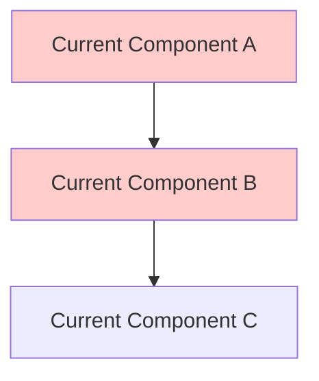
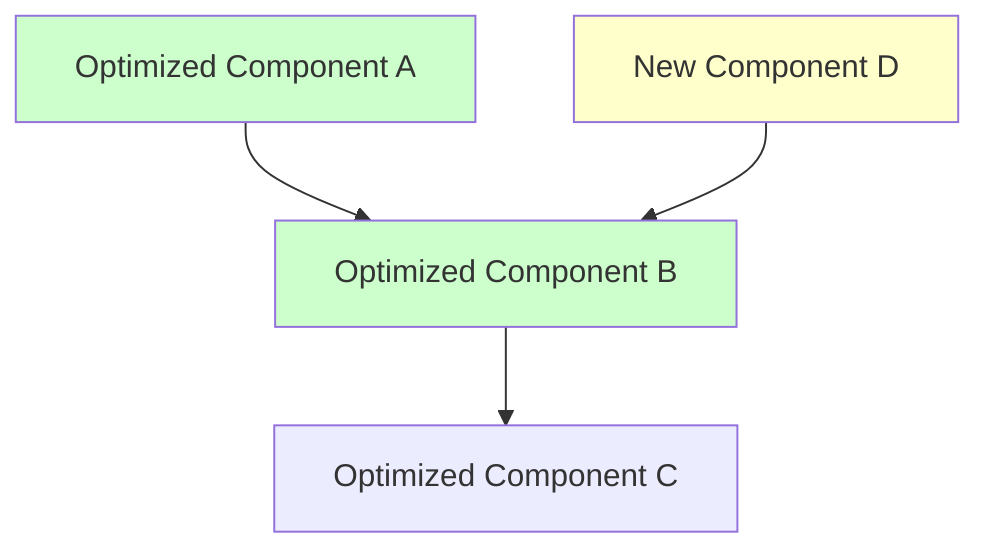
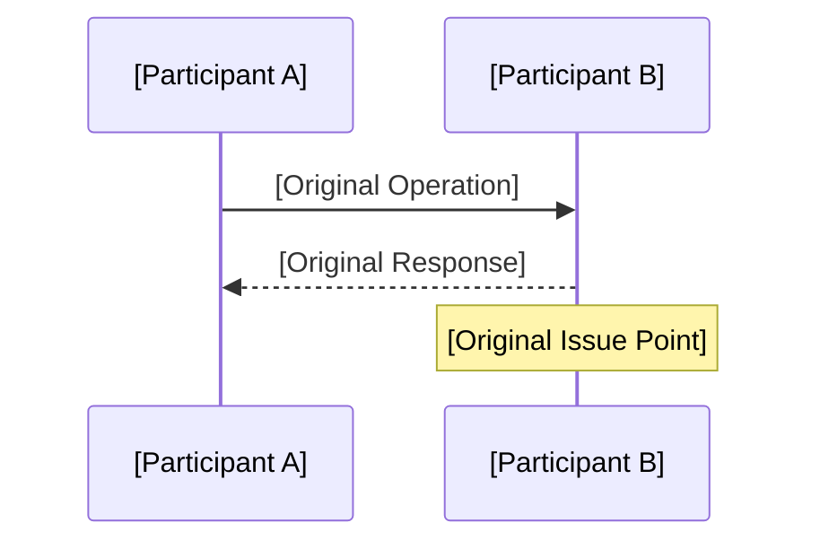
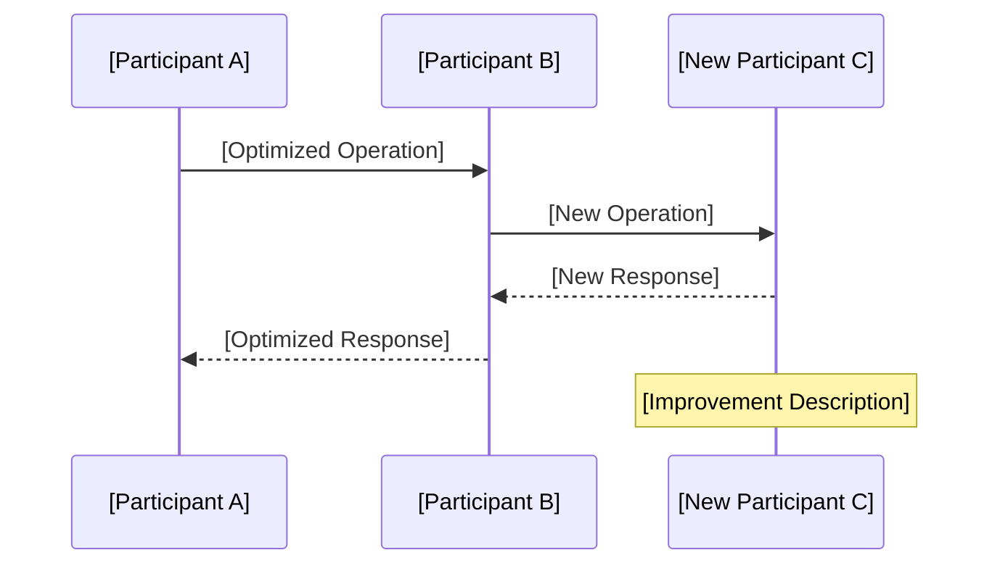

# Version Iteration Design Document Template

<!-- Template Usage Guide -->
<!-- 
📋 Usage Instructions:
1. Replace all [placeholders] with specific content
2. Remove inapplicable sections and conditional content
3. Delete all comment lines starting with <!--
4. Select appropriate sections based on iteration type:
   - Feature addition/modification: Keep 2.2.1 Feature Design
   - Performance optimization: Keep 2.2.2 Performance Optimization Design
   - Refactoring optimization: Keep 2.2.3 Refactoring Design
5. Optional sections guidance:
   - Chapter 5: Use for complex iterations requiring detailed planning
   - Chapter 6: Use for performance optimization and critical feature changes requiring focused monitoring
   - Chapter 7: Use when summarizing benefits and planning follow-up work
   - Appendix: Add based on actual needs
-->

**Document Version**: v1.0  
**Creation Date**: [YYYY-MM-DD]  
**Document Status**: [Draft/Under Review/Approved]  
**Iteration Version**: [v1.x.x]  
**Iteration Type**: [Feature Addition/Feature Modification/Performance Optimization/Refactoring Optimization]  
**Target Audience**: Technical Team, Product Team, QA Team  
**Review Type**: Version Iteration Technical Review  

## Executive Summary

<!-- Core value and key changes of this iteration, keep within 80 words -->
[Core problem solved by this iteration + Major technical changes + Expected benefits]

## 1. Iteration Background and Objectives

### 1.1 Iteration Drivers

<!-- Choose business drivers for feature iterations, technical drivers for optimization iterations -->
**Business Drivers**:
- [User requirement changes]
- [Market competition demands]
- [Business metric improvement needs]

**Technical Drivers**:
- [Performance bottleneck issues]
- [Technical debt cleanup]
- [Architecture evolution requirements]
- [Security compliance requirements]

### 1.2 Current State Analysis

**Current System Status**:
- [Key Metric 1]: [Current Value] (Target: [Target Value])
- [Key Metric 2]: [Current Value] (Target: [Target Value])
- [Key Metric 3]: [Current Value] (Target: [Target Value])

**Existing Issues**:
- [Issue 1] [Impact scope and severity]
- [Issue 2] [Impact scope and severity]

### 1.3 Iteration Objectives

**Primary Objectives**:
1. [Objective 1] [Specific metrics and acceptance criteria]
2. [Objective 2] [Specific metrics and acceptance criteria]
3. [Objective 3] [Specific metrics and acceptance criteria]

**Success Criteria**:
- [Acceptance Criterion 1]
- [Acceptance Criterion 2]
- [Acceptance Criterion 3]

## 2. Change Design

### 2.1 Change Scope

**Affected Components**:
- [Component 1] [Change Type: Add/Modify/Delete/Optimize]
- [Component 2] [Change Type: Add/Modify/Delete/Optimize]
- [Component 3] [Change Type: Add/Modify/Delete/Optimize]

**Unaffected Components**:
- [Explicitly state unchanged components to avoid confusion]

### 2.2 Technical Solution

<!-- Select appropriate sections based on iteration type, remove inapplicable sections -->
#### 2.2.1 Feature Design

**New Features**:
- [Feature 1] [Feature description and implementation approach]
- [Feature 2] [Feature description and implementation approach]

**Modified Features**:
- [Feature 1] [Modification details and impact scope]
- [Feature 2] [Modification details and impact scope]

**API Changes**:
```yaml
# New APIs
POST /api/v1/[resource]
  summary: [API description]
  parameters:
    - name: [parameter name]
      type: [data type]
      required: [true/false]

# Modified APIs (if any)
PUT /api/v1/[resource]/{id}
  summary: [Modification description]
  # Change details
```

#### 2.2.2 Performance Optimization Design

**Optimization Targets**:
- [Performance Metric 1]: From [Current Value] to [Target Value]
- [Performance Metric 2]: From [Current Value] to [Target Value]

**Optimization Strategies**:
- [Strategy 1] [Specific implementation method]
- [Strategy 2] [Specific implementation method]
- [Strategy 3] [Specific implementation method]

**Resource Optimization**:
- [CPU Optimization] [Specific measures]
- [Memory Optimization] [Specific measures]
- [I/O Optimization] [Specific measures]

#### 2.2.3 Refactoring Design

**Refactoring Objectives**:
- [Code quality improvement]
- [Architecture optimization]
- [Technical debt cleanup]

**Refactoring Scope**:
- [Module 1] [Refactoring content and rationale]
- [Module 2] [Refactoring content and rationale]

**Refactoring Strategy**:
- [Strategy 1] [Specific implementation method]
- [Strategy 2] [Specific implementation method]

### 2.3 Architecture Changes

#### 2.3.1 Current Architecture


#### 2.3.2 Target Architecture


#### 2.3.3 Key Change Descriptions
- [Change 1] [Reason for change and expected impact]
- [Change 2] [Reason for change and expected impact]
- [Change 3] [Reason for change and expected impact]

### 2.4 Data Changes

#### 2.4.1 Data Model Changes
```sql
-- Add tables/fields
ALTER TABLE [table_name] ADD COLUMN [field_name] [data_type] [constraints];

-- Modify table structure
ALTER TABLE [table_name] MODIFY COLUMN [field_name] [new_data_type];

-- Add indexes
CREATE INDEX [index_name] ON [table_name] ([field_list]);
```

#### 2.4.2 Data Migration Strategy
- [Migration Step 1] [Specific operations and validation methods]
- [Migration Step 2] [Specific operations and validation methods]
- [Rollback Plan] [Specific steps for data rollback]

## 3. Key Process Changes

### 3.1 [Change Process 1 Name]

#### 3.1.1 Current Process


#### 3.1.2 Optimized Process


#### 3.1.3 Improvement Impact
- [Improvement 1] [Specific impact]
- [Improvement 2] [Specific impact]

### 3.2 [Change Process 2 Name]
[Add other key process changes as needed]

## 4. Compatibility and Risk Analysis

### 4.1 Compatibility Assessment

| Compatibility Type | Impact Assessment | Mitigation Measures | Validation Methods |
|-------------------|-------------------|--------------------|--------------------|
| API Compatibility | [Impact Level] | [Mitigation Measures] | [Validation Methods] |
| Data Compatibility | [Impact Level] | [Mitigation Measures] | [Validation Methods] |
| Client Compatibility | [Impact Level] | [Mitigation Measures] | [Validation Methods] |

### 4.2 Risk Identification and Control

| Risk Type | Risk Description | Impact Level | Prevention Measures | Contingency Plan |
|-----------|------------------|--------------|--------------------|--------------------|
| [Technical Risk] | [Risk Description] | [High/Medium/Low] | [Prevention Measures] | [Contingency Plan] |
| [Business Risk] | [Risk Description] | [High/Medium/Low] | [Prevention Measures] | [Contingency Plan] |
| [Operational Risk] | [Risk Description] | [High/Medium/Low] | [Prevention Measures] | [Contingency Plan] |

### 4.3 Rollback Strategy

**Rollback Trigger Conditions**:
- [Condition 1] [Specific metric thresholds]
- [Condition 2] [Specific metric thresholds]

**Rollback Steps**:
1. [Step 1] [Specific operations]
2. [Step 2] [Specific operations]
3. [Step 3] [Specific operations]

**Rollback Validation**:
- [Validation Item 1] [Validation method]
- [Validation Item 2] [Validation method]

## 5. Implementation Plan

<!-- This section applies to complex iterations requiring detailed planning; simple feature modifications can be deleted -->
### 5.1 Development Plan

| Phase | Task | Owner | Start Date | End Date | Deliverables |
|-------|------|-------|------------|----------|--------------|
| Development Phase | [Development Task] | [Owner] | [Date] | [Date] | [Deliverables] |
| Testing Phase | [Testing Task] | [Owner] | [Date] | [Date] | [Deliverables] |
| Release Phase | [Release Task] | [Owner] | [Date] | [Date] | [Deliverables] |

### 5.2 Testing Strategy

**Testing Scope**:
- [Functional Testing] [Testing focus]
- [Performance Testing] [Testing metrics]
- [Compatibility Testing] [Testing scenarios]
- [Regression Testing] [Testing scope]

**Testing Environments**:
- [Development Environment] [Environment configuration]
- [Testing Environment] [Environment configuration]
- [Staging Environment] [Environment configuration]

### 5.3 Release Strategy

**Release Approach**:
- [Canary Release] [Release percentage and strategy]
- [Blue-Green Deployment] [Switching strategy]
- [Rolling Update] [Update strategy]

**Release Checkpoints**:
- [Checkpoint 1] [Check content and criteria]
- [Checkpoint 2] [Check content and criteria]
- [Checkpoint 3] [Check content and criteria]

## 6. Monitoring and Validation

<!-- This section applies to performance optimization and critical feature changes requiring focused monitoring -->
### 6.1 Key Metrics Monitoring

| Metric Type | Metric Name | Current Value | Target Value | Monitoring Method |
|-------------|-------------|---------------|--------------|-------------------|
| Business Metrics | [Metric 1] | [Current Value] | [Target Value] | [Monitoring Tool] |
| Technical Metrics | [Metric 2] | [Current Value] | [Target Value] | [Monitoring Tool] |
| User Experience | [Metric 3] | [Current Value] | [Target Value] | [Monitoring Tool] |

### 6.2 Alert Configuration

| Alert Type | Trigger Condition | Alert Level | Response Method |
|------------|-------------------|-------------|-----------------|
| [Business Alert] | [Trigger Condition] | [Critical/Warning/Info] | [Response Process] |
| [Performance Alert] | [Trigger Condition] | [Critical/Warning/Info] | [Response Process] |
| [Error Alert] | [Trigger Condition] | [Critical/Warning/Info] | [Response Process] |

### 6.3 Acceptance Criteria

**Functional Acceptance**:
- [Acceptance Item 1] [Acceptance criteria]
- [Acceptance Item 2] [Acceptance criteria]

**Performance Acceptance**:
- [Performance Metric 1] [Acceptance criteria]
- [Performance Metric 2] [Acceptance criteria]

**Stability Acceptance**:
- [Stability Metric 1] [Acceptance criteria]
- [Stability Metric 2] [Acceptance criteria]

## 7. Summary and Future Planning

<!-- This section applies to iterations requiring benefit summary and follow-up work planning -->
### 7.1 Expected Benefits

**Business Benefits**:
- [Benefit 1] [Specific values and calculation methods]
- [Benefit 2] [Specific values and calculation methods]

**Technical Benefits**:
- [Benefit 1] [Specific improvement effects]
- [Benefit 2] [Specific improvement effects]

### 7.2 Future Planning

**Short-term Planning** (1-3 months):
- [Plan 1] [Specific content]
- [Plan 2] [Specific content]

**Medium-term Planning** (3-6 months):
- [Plan 1] [Specific content]
- [Plan 2] [Specific content]

### 7.3 Lessons Learned

**Success Factors**:
- [Factor 1] [Specific description]
- [Factor 2] [Specific description]

**Improvement Recommendations**:
- [Recommendation 1] [Specific content]
- [Recommendation 2] [Specific content]

---

## Appendix

<!-- The following appendix sections are optional content, add based on actual needs -->
### A. Related Documents
- [Architecture Design Document] [Link]
- [API Documentation] [Link]
- [Operations Manual] [Link]

### B. Technical Research
- [Research Report 1] [Link or summary]
- [Research Report 2] [Link or summary]

### C. Change Log
| Version | Date | Changes | Author |
|---------|------|---------|--------|
| v1.0 | [Date] | [Initial version] | [Name] |
| v1.1 | [Date] | [Change content] | [Name] |