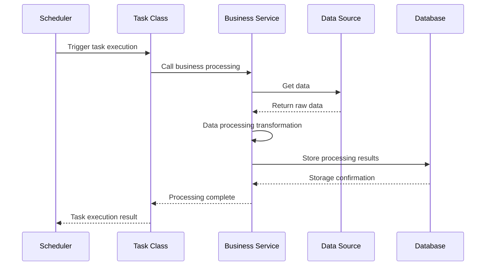

# Task Module Technical Documentation Standards

> **Documentation Storage Requirements**:
> - **MUST store task documentation in `docs/tasks/` directory**
> - File structure: `docs/tasks/[task-name].md`
> - Example: `docs/tasks/data-error-notification.md`, `docs/tasks/gracenote-user-cleanup.md`
> 
> **Module Organization**:
> - **API Endpoints**: Store API documentation in `docs/api/`
> - **Tasks**: Store task documentation in `docs/tasks/`
> - **Projects with both**: Use both `docs/api/` and `docs/tasks/` directories

> **File Naming Requirements**:
> - Use **kebab-case** for task documentation files
> - Name files based on **business functionality**, not implementation details
> - Follow naming conventions from [NAMING-CONVENTIONS.md](NAMING-CONVENTIONS.md)
> 
> **Examples**:
> - `data-error-notification.md` ✓ (business function)
> - `gracenote-user-cleanup.md` ✓ (business function)
> - `DataErrorTask.md` ✗ (implementation detail)
> - `data_error_task.md` ✗ (snake_case)

## Task Detail Documentation Template

```markdown
# [Business Function Name] - [Brief Description]

## Task Usage Scenarios

**Task Name**: `[Business Function Name]`  
**Business Scenario**: [Specific business problem this task solves]  
**Trigger Conditions**: [When this task is executed]  
**Execution Frequency**: [How often it runs]

## Data Sources

| Data Source Name | Type | Access Method | Data Format | Update Frequency |
|------------------|------|---------------|-------------|------------------|
| [Data Source 1] | [API/File/DB] | [HTTP/FTP/JDBC] | [JSON/XML/CSV] | [Real-time/Hourly/Daily] |
| [Data Source 2] | [API/File/DB] | [HTTP/FTP/JDBC] | [JSON/XML/CSV] | [Real-time/Hourly/Daily] |

## Core Processing Logic

### Processing Steps

1. **Data Acquisition**: [Where to get data, how to get it]
2. **Data Validation**: [Which fields to validate, validation rules]
3. **Data Transformation**: [How to transform data format]
4. **Data Storage**: [Where to store, storage format]

## Sequence Diagram



## Data Flow

```
[External Data Source] → [Data Acquisition] → [Data Validation] → [Data Transformation] → [Data Storage]
         ↓                      ↓                   ↓                    ↓                   ↓
    Raw Data            Validated Data        Standard Data        Business Data      Persistent Data
```

## Data Storage

### Storage Methods

| Storage Type | Storage Location | Data Format | Purpose |
|--------------|------------------|-------------|---------|
| [Primary Storage] | [MySQL/Redis/ES] | [Table Structure/JSON] | [Main business data] |
| [Cache] | [Redis] | [Key-Value] | [Fast query] |
| [Backup] | [File System] | [JSON/CSV] | [Data backup] |

### Data Structure

```json
{
  "id": "string",
  "taskName": "string",
  "processTime": "timestamp",
  "data": {
    "field1": "value1",
    "field2": "value2"
  },
  "status": "success/failed",
  "metrics": {
    "processedCount": "number",
    "errorCount": "number"
  }
}
```

## Related Standards

- **[Naming Conventions](NAMING-CONVENTIONS.md)** - File and documentation naming standards