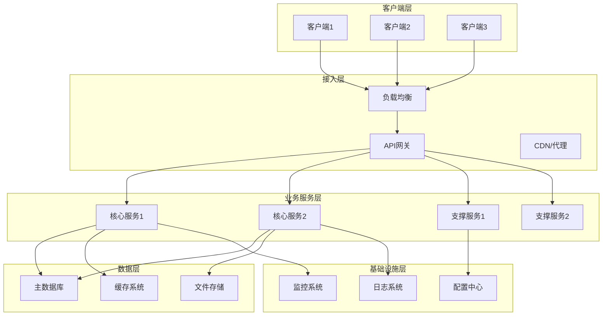
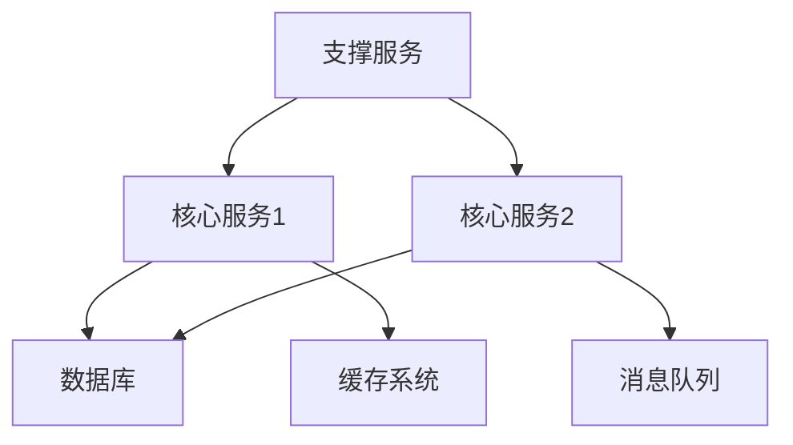
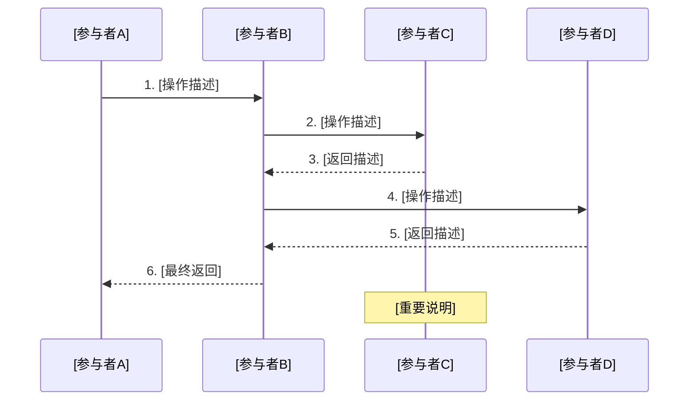
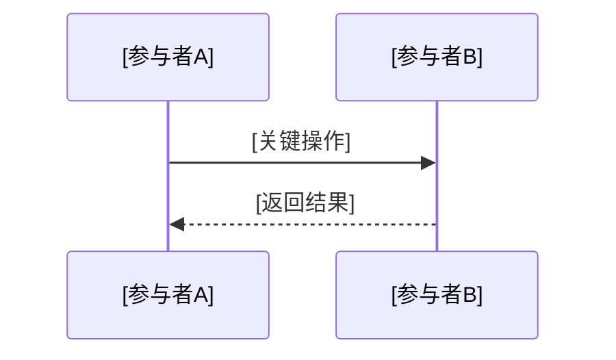
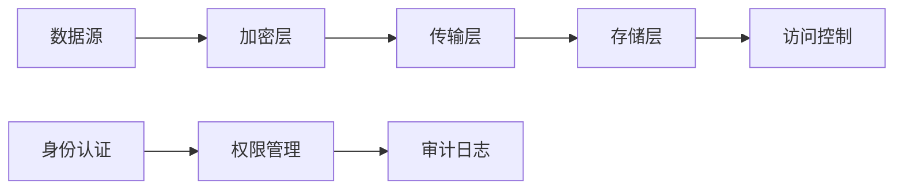
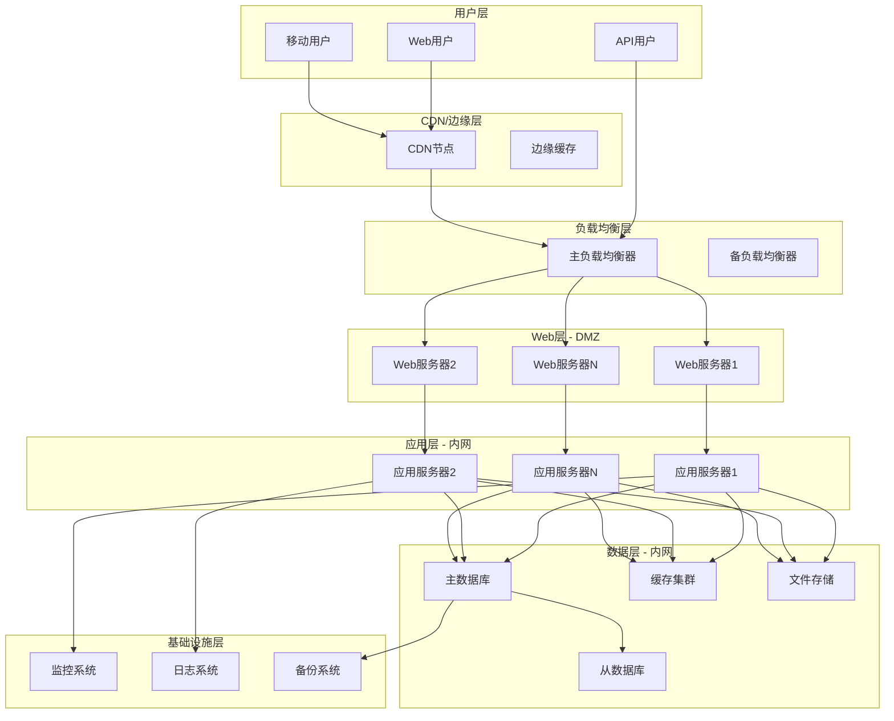
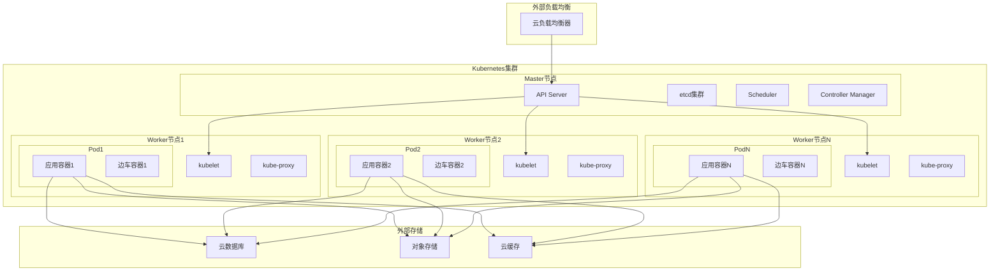
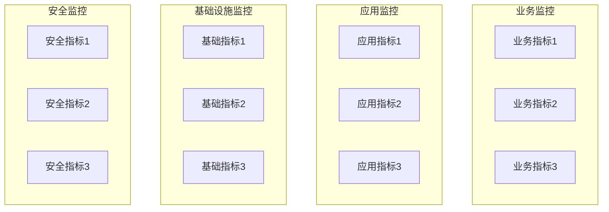
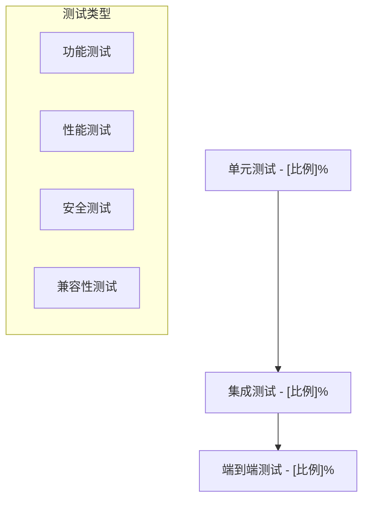

# 系统架构设计文档模板

> **📋 使用说明**: 使用时请替换所有`[占位符]`为具体内容，删除不适用章节。

**文档版本**: v1.0  
**创建日期**: [YYYY-MM-DD]  
**文档状态**: [草案/待评审/已批准]  
**目标读者**: 技术团队、产品团队、管理层、运维团队  
**评审类型**: 技术架构评审  

## 执行摘要

> **✍️ 编写指导**: 核心价值和关键决策的高度概括，控制在100字以内，让决策者快速判断项目价值。

[系统解决的核心问题 + 关键技术方案 + 预期收益，一段话说清楚项目的本质价值]

## 1. 业务需求

> **🎯 章节目标**: 明确业务目标和技术约束，为架构设计提供决策依据。

### 1.1 业务背景

> **💡 分析框架**: 深入剖析现状痛点，建立量化的问题-解决方案映射关系。

**现状分析**:
- [当前业务流程描述]
- [现有系统能力评估]
- [用户体验痛点分析]

**问题识别**:
- [核心问题1] [具体表现和影响范围]
- [核心问题2] [具体表现和影响范围]
- [核心问题3] [具体表现和影响范围]

**解决方案**:
- [技术解决路径]
- [预期改进效果]
- [成功衡量标准]

### 1.2 使用场景

> **📝 编写要点**: 按优先级排序，包含用户角色和关键操作流程。

1. **核心场景** [描述最重要的使用场景]
2. **扩展场景** [描述其他重要场景]

### 1.3 核心需求

> **⚡ 关键提醒**: 聚焦核心功能和关键指标，确保可测量和可验证。

**功能需求**:
- [核心功能1] [简要描述和验收标准]
- [核心功能2] [简要描述和验收标准]
- [核心功能3] [简要描述和验收标准]

**质量属性**:
- **性能** [响应时间] < [X]ms, [吞吐量] > [X] QPS
- **可用性** [系统可用性] > [X]%
- **扩展性** 支持[X]倍用户增长
- **安全性** [加密标准]和[访问控制机制]

### 1.4 约束条件

> **⚖️ 约束识别**: 明确技术、业务和合规约束，影响架构设计决策。

- **技术约束** [现有系统、技术栈、团队技能等限制]
- **业务约束** [时间、预算、资源等限制]
- **合规要求** [相关法规和行业标准要求]

## 2. 架构设计

> **🏛️ 章节目标**: 展示系统的逻辑结构和物理部署，遵循分层架构和微服务设计原则。

### 2.1 设计原则和技术选型

> **🎨 设计理念**: 基于业务需求制定核心原则，指导技术选型决策。

**架构原则**:
1. **[原则1]** [具体描述和理由]
2. **[原则2]** [具体描述和理由]
3. **[原则3]** [具体描述和理由]

**核心技术选型**:

| 组件 | 选型 | 理由 |
|------|------|------|
| [数据库] | [技术] | [理由] |
| [缓存] | [技术] | [理由] |
| [消息队列] | [技术] | [理由] |

### 2.2 系统架构

> **📐 架构视图**: 使用C4模型或分层架构展示。确保层次清晰、职责分离、依赖单向。



### 2.3 服务依赖分析

> **🔗 依赖治理**: 识别关键路径和单点故障，设计降级和熔断策略。

#### 2.3.1 依赖关系图



#### 2.3.2 关键依赖分析

> **💡 设计要点**: 按影响级别分类，高影响依赖必须有降级方案。

| 服务 | 依赖组件 | 影响级别 | 降级策略 | 熔断机制 |
|------|----------|----------|----------|----------|
| [服务1] | [依赖组件] | [高/中/低] | [降级策略] | [熔断机制] |
| [服务2] | [依赖组件] | [高/中/低] | [降级策略] | [熔断机制] |

#### 2.3.3 弹性设计

> **🛡️ 容错机制**: 实现故障隔离、快速失败、优雅降级。

- **超时机制**: [请求超时设置和处理]
- **重试策略**: [指数退避、最大重试次数]
- **熔断器**: [服务熔断触发条件和恢复机制]

### 2.4 服务拆分设计

> **🔧 微服务设计**: 遵循DDD领域驱动设计，确保高内聚低耦合。

#### 2.4.1 [核心服务1名称]

> **📋 服务定义**: 明确边界上下文，避免服务间数据耦合。

**职责边界**:
- [主要职责1]
- [主要职责2]
- [主要职责3]
- 不负责 [明确不负责的内容]

**接口设计**:

> **🔌 API设计**: 遵循RESTful规范，使用OpenAPI 3.0标准。

```yaml
openapi: 3.0.0
info:
  title: [服务名称] API
  version: 1.0.0
paths:
  /api/v1/[资源]:
    post:
      summary: [操作描述]
      requestBody:
        required: true
        content:
          application/json:
            schema:
              type: object
              properties:
                [字段名]:
                  type: [数据类型]
                  description: [字段描述]
      responses:
        '200':
          description: [成功响应描述]
          content:
            application/json:
              schema:
                type: object
                properties:
                  [返回字段]:
                    type: [数据类型]
                    description: [字段描述]
```

#### 2.4.2 [核心服务2名称]
**职责边界**:
- [主要职责1]
- [主要职责2]
- 不负责 [明确不负责的内容]

### 2.5 数据架构设计

> **🗄️ 数据治理**: 设计可扩展的数据模型，考虑ACID特性和CAP定理权衡。

#### 2.5.1 数据模型

> **📊 建模原则**: 遵循数据库范式，合理使用反范式优化。添加审计字段。

```sql
-- [主要实体表]
CREATE TABLE [表名] (
    [主键字段] [数据类型] PRIMARY KEY,
    [业务字段1] [数据类型] NOT NULL,
    [业务字段2] [数据类型],
    [状态字段] ENUM('[状态1]', '[状态2]') DEFAULT '[默认状态]',
    created_at TIMESTAMP DEFAULT CURRENT_TIMESTAMP,
    updated_at TIMESTAMP DEFAULT CURRENT_TIMESTAMP ON UPDATE CURRENT_TIMESTAMP,
    INDEX [索引名] ([字段列表]),
    INDEX [索引名] ([字段列表])
);
```

#### 2.5.2 缓存策略

> **⚡ 缓存设计**: 选择合适的缓存模式(Cache-Aside/Write-Through/Write-Behind)。

| 数据类型 | 缓存时间 | 更新策略 | 缓存键格式 |
|----------|----------|----------|------------|
| [数据类型1] | [时间] | [更新策略] | [键格式] |
| [数据类型2] | [时间] | [更新策略] | [键格式] |
| [数据类型3] | [时间] | [更新策略] | [键格式] |

#### 2.5.3 数据存储扩展性

> **📈 扩展策略**: 基于业务增长预测制定扩展方案，考虑分片键选择。

| 扩展维度 | 当前规模 | 目标规模 | 扩展策略 | 性能影响 |
|----------|----------|----------|----------|----------|
| 数据量 | [当前规模] | [目标规模] | [分库分表/分区] | [查询性能影响] |
| 并发量 | [当前规模] | [目标规模] | [读写分离/连接池] | [响应时间影响] |
| 查询复杂度 | [当前规模] | [目标规模] | [索引优化/物化视图] | [资源消耗影响] |

#### 2.5.4 客户端缓存策略（适用于移动应用）

> **📱 移动端优化**: 考虑网络环境和设备限制，实现离线可用。

| 缓存类型 | 缓存内容 | 刷新策略 | 存储位置 | 失效机制 |
|----------|----------|----------|----------|----------|
| 内存缓存 | [热点数据] | [实时更新] | [内存] | [应用重启] |
| 本地存储 | [用户数据] | [增量同步] | [本地数据库] | [版本检查] |
| 网络缓存 | [静态资源] | [条件请求] | [HTTP缓存] | [ETag/Last-Modified] |

**缓存一致性保证**:
- **先更新数据再刷新缓存** [确保数据一致性的机制]
- **版本控制** [缓存版本管理策略]
- **冲突解决** [缓存与服务器数据不一致时的处理]

## 3. 核心业务流程

> **🔄 流程设计**: 使用时序图展示关键业务流程，包含异常处理和补偿机制。按业务重要性排序，核心流程必须详细描述，次要流程可简化处理。

> **📝 多流程处理指导**: 
> - **核心流程(P0)**: 必须详细描述，包含完整时序图、异常处理、补偿机制
> - **重要流程(P1)**: 需要时序图和主要异常处理
> - **一般流程(P2)**: 可用文字描述或简化流程图
> - 建议核心流程不超过5个，避免文档过于冗长

### 3.1 [核心业务流程1名称] - P0

> **📋 流程说明**: 描述业务价值、触发条件、前置条件、后置状态。



### 3.2 [重要业务流程2名称] - P1

> **📋 流程说明**: [简要描述业务价值和关键步骤]



**关键异常处理**:
- [主要异常场景] [处理策略]

### 3.3 [一般业务流程3名称] - P2

> **📋 流程说明**: [简要描述流程目的和主要步骤]

**主要步骤**:
1. [步骤1] [简要描述]
2. [步骤2] [简要描述]
3. [步骤3] [简要描述]

### 3.4 异常处理流程

> **🚨 异常设计**: 分类处理业务异常和系统异常，提供用户友好的错误信息。

| 异常场景 | 检测方式 | 处理策略 | 恢复机制 |
|----------|----------|----------|----------|
| [异常1] | [检测方法] | [处理策略] | [恢复方法] |
| [异常2] | [检测方法] | [处理策略] | [恢复方法] |
| [异常3] | [检测方法] | [处理策略] | [恢复方法] |

### 3.5 风险控制机制

> **🛡️ 风控体系**: 建立多层防护，支持快速止损和业务连续性。

#### 3.5.1 功能开关设计

> **🎛️ 开关策略**: 支持细粒度控制，配置热更新，操作可审计。

| 开关类型 | 控制范围 | 开关策略 | 应急响应 |
|----------|----------|----------|----------|
| 功能开关 | [新功能模块] | [灰度发布/全量关闭] | [快速回滚] |
| 流量开关 | [高风险接口] | [按比例限流] | [降级服务] |
| 版本开关 | [整个版本] | [分批发布] | [紧急停止] |

#### 3.5.2 高并发支持

> **⚡ 并发设计**: 基于业务特点选择合适的并发模型和限流算法。

- **负载均衡**: [负载均衡算法和策略]
- **限流机制**: [令牌桶/滑动窗口等限流算法]
- **资源隔离**: [线程池/连接池隔离策略]
- **异步处理**: [消息队列/事件驱动架构]

#### 3.5.3 异常日志设计

> **📝 日志规范**: 结构化日志，包含链路追踪ID，便于问题定位。

| 日志类型 | 记录内容 | 日志级别 | 存储策略 |
|----------|----------|----------|----------|
| 业务日志 | [关键业务操作] | [INFO/WARN] | [长期存储] |
| 错误日志 | [异常堆栈/错误上下文] | [ERROR/FATAL] | [实时告警] |
| 性能日志 | [响应时间/资源使用] | [DEBUG/INFO] | [定期清理] |
| 安全日志 | [登录/权限变更] | [WARN/ERROR] | [合规存储] |

## 4. 安全架构设计

> **🔒 安全体系**: 基于零信任架构，实现纵深防御和最小权限原则。

### 4.1 安全架构图

> **🛡️ 安全模型**: 展示数据流经的安全控制点，确保全链路保护。



### 4.2 安全控制矩阵

> **🎯 威胁建模**: 基于STRIDE模型识别威胁，制定对应控制措施。

| 安全层面 | 威胁类型 | 控制措施 | 验证方法 |
|----------|----------|----------|----------|
| [安全层面1] | [威胁描述] | [控制措施] | [验证方法] |
| [安全层面2] | [威胁描述] | [控制措施] | [验证方法] |
| [安全层面3] | [威胁描述] | [控制措施] | [验证方法] |

### 4.3 数据保护策略

> **🔐 数据安全**: 分类分级保护，全生命周期安全管理。

- **数据分类**: [敏感数据的分类标准]
- **加密策略**: [传输和存储加密方案]
- **访问控制**: [权限管理机制]
- **审计要求**: [日志记录和审计要求]

### 4.4 安全漏洞防护

> **🚫 漏洞防护**: 基于OWASP Top 10制定防护策略，定期安全扫描。

| 漏洞类型 | 防护措施 | 检测方法 | 修复机制 |
|----------|----------|----------|----------|
| SQL注入 | [参数化查询/ORM框架] | [静态代码扫描] | [紧急补丁] |
| XSS攻击 | [输入过滤/输出编码] | [安全扫描工具] | [内容安全策略] |
| CSRF攻击 | [Token验证/SameSite] | [渗透测试] | [双重验证] |
| 权限提升 | [最小权限原则] | [权限审计] | [权限回收] |
| 数据泄露 | [数据脱敏/访问控制] | [数据扫描] | [数据隔离] |

### 4.5 客户端安全（适用于移动应用）

> **📱 移动安全**: 考虑设备多样性和安全威胁，实现多层防护。

#### 4.5.1 代码保护
- **代码混淆**: [防止逆向工程的混淆策略]
- **反调试**: [防止动态调试的机制]
- **代码签名**: [应用签名验证机制]

#### 4.5.2 运行时安全
- **根检测**: [检测设备是否被root的机制]
- **模拟器检测**: [检测是否在模拟器中运行]
- **调试检测**: [检测是否被调试器附加]

#### 4.5.3 数据安全
- **证书绑定**: [防止中间人攻击的证书验证]
- **本地存储加密**: [敏感数据本地存储加密]
- **内存保护**: [防止内存dump的保护机制]

## 5. 性能与容量规划

> **⚡ 性能工程**: 基于业务目标制定性能指标，建立性能基线和监控体系。

### 5.1 性能目标

> **📊 指标体系**: 设定可测量的性能目标，建立SLA/SLO体系。

| 指标类别 | 具体指标 | 目标值 | 测量方法 | 监控阈值 |
|----------|----------|--------|----------|----------|
| 响应性能 | [具体指标] | [目标值] | [测量方法] | [告警阈值] |
| 吞吐性能 | [具体指标] | [目标值] | [测量方法] | [告警阈值] |
| 并发性能 | [具体指标] | [目标值] | [测量方法] | [告警阈值] |

### 5.2 容量规划

> **📈 容量模型**: 基于业务增长预测和历史数据建立容量模型。

**当前规模**:
- [关键指标1] [当前数值]
- [关键指标2] [当前数值]
- [关键指标3] [当前数值]

**扩展规模**:
- [关键指标1] [目标数值]
- [关键指标2] [目标数值]
- [关键指标3] [目标数值]

### 5.3 性能优化策略

> **🚀 优化方法**: 基于性能测试结果制定优化策略，优先解决瓶颈问题。

1. **[优化方向1]**
   - [具体措施1]
   - [具体措施2]
   - [具体措施3]

2. **[优化方向2]**
   - [具体措施1]
   - [具体措施2]

### 5.4 性能瓶颈识别

> **🔍 瓶颈分析**: 建立性能基线，持续监控关键指标，及时发现瓶颈。

| 潜在瓶颈 | 影响程度 | 检测方法 | 优化方案 | 预防措施 |
|----------|----------|----------|----------|----------|
| 数据库连接池 | [高/中/低] | [连接数监控] | [连接池优化] | [连接池配置] |
| 内存泄漏 | [高/中/低] | [内存监控] | [内存优化] | [代码审查] |
| 缓存穿透 | [高/中/低] | [缓存命中率] | [缓存策略] | [缓存预热] |
| 慢查询 | [高/中/低] | [查询时间监控] | [索引优化] | [查询审查] |

### 5.5 压力测试计划

> **🧪 测试策略**: 建立完整的性能测试体系，覆盖各种负载场景。

| 测试类型 | 测试目标 | 测试工具 | 执行频率 | 验收标准 |
|----------|----------|----------|----------|----------|
| 基准测试 | [单机性能基线] | [测试工具] | [每次发布] | [性能不退化] |
| 压力测试 | [最大负载能力] | [测试工具] | [每月] | [系统不崩溃] |
| 稳定性测试 | [长时间运行] | [测试工具] | [每季度] | [无内存泄漏] |
| 容量测试 | [数据量极限] | [测试工具] | [每半年] | [数据处理正常] |

## 6. 部署与运维

> **🚀 DevOps实践**: 实现基础设施即代码，建立自动化运维体系。

### 6.1 部署架构图

> **🏗️ 部署拓扑**: 展示物理部署结构，包含网络、安全边界和资源分布。



### 6.2 环境架构

> **🏗️ 环境管理**: 环境一致性，配置外部化，支持蓝绿部署。

| 环境类型 | 用途 | 配置规格 | 数据隔离策略 |
|----------|------|----------|--------------|
| 开发环境 | [用途描述] | [配置描述] | [隔离策略] |
| 测试环境 | [用途描述] | [配置描述] | [隔离策略] |
| 预生产环境 | [用途描述] | [配置描述] | [隔离策略] |
| 生产环境 | [用途描述] | [配置描述] | [隔离策略] |

### 6.3 容器化部署

> **🐳 容器化**: 使用Kubernetes编排，实现不可变基础设施。

#### 6.3.1 Kubernetes部署架构

> **⚙️ K8s集群**: 展示Kubernetes集群的部署结构和网络拓扑。



#### 6.3.2 容器部署配置

```yaml
# 部署配置示例
apiVersion: apps/v1
kind: Deployment
metadata:
  name: [服务名称]
spec:
  replicas: [副本数]
  selector:
    matchLabels:
      app: [应用标签]
  template:
    metadata:
      labels:
        app: [应用标签]
    spec:
      containers:
      - name: [容器名称]
        image: [镜像地址]
        ports:
        - containerPort: [端口号]
        env:
        - name: [环境变量名]
          valueFrom:
            secretKeyRef:
              name: [密钥名称]
              key: [密钥键]
        resources:
          requests:
            memory: "[内存请求]"
            cpu: "[CPU请求]"
          limits:
            memory: "[内存限制]"
            cpu: "[CPU限制]"
        livenessProbe:
          httpGet:
            path: [健康检查路径]
            port: [端口号]
          initialDelaySeconds: [初始延迟]
          periodSeconds: [检查间隔]
```

### 6.4 配置管理

> **⚙️ 配置治理**: 配置与代码分离，支持动态更新，版本可追溯。

#### 6.4.1 配置分类管理

| 配置类型 | 存储方式 | 更新机制 | 安全策略 | 版本控制 |
|----------|----------|----------|----------|----------|
| 应用配置 | [配置中心] | [热更新] | [权限控制] | [Git管理] |
| 数据库配置 | [加密存储] | [重启生效] | [密文存储] | [备份管理] |
| 第三方服务 | [密钥管理] | [API更新] | [密钥轮换] | [审计日志] |
| 环境变量 | [K8s Secret] | [容器重启] | [最小权限] | [镜像版本] |

#### 6.4.2 配置更新流程


### 6.5 自动扩缩容

> **📊 弹性伸缩**: 基于业务指标自动调整资源，优化成本和性能。

#### 6.5.1 扩缩容策略

| 服务 | 扩容指标 | 扩容阈值 | 缩容阈值 | 最大实例数 | 冷却时间 |
|------|----------|----------|----------|------------|----------|
| [服务1] | [CPU/内存/QPS] | [阈值] | [阈值] | [最大数] | [时间] |
| [服务2] | [CPU/内存/QPS] | [阈值] | [阈值] | [最大数] | [时间] |

#### 6.5.2 弹性伸缩配置

> **⚡ HPA配置**: 多指标扩缩容，避免频繁抖动。

```yaml
# HPA配置示例
apiVersion: autoscaling/v2
kind: HorizontalPodAutoscaler
metadata:
  name: [服务名称]-hpa
spec:
  scaleTargetRef:
    apiVersion: apps/v1
    kind: Deployment
    name: [服务名称]
  minReplicas: [最小副本数]
  maxReplicas: [最大副本数]
  metrics:
  - type: Resource
    resource:
      name: cpu
      target:
        type: Utilization
        averageUtilization: [目标CPU使用率]
  - type: Resource
    resource:
      name: memory
      target:
        type: Utilization
        averageUtilization: [目标内存使用率]
  behavior:
    scaleUp:
      stabilizationWindowSeconds: [稳定窗口]
      policies:
      - type: Percent
        value: [扩容比例]
        periodSeconds: [扩容周期]
    scaleDown:
      stabilizationWindowSeconds: [稳定窗口]
      policies:
      - type: Percent
        value: [缩容比例]
        periodSeconds: [缩容周期]
```

### 6.6 CI/CD流程

> **🔄 持续交付**: 自动化构建、测试、部署，确保交付质量和效率。


## 7. 监控与告警

> **👁️ 可观测性**: 建立全方位监控体系，实现问题快速发现和定位。

### 7.1 监控体系

> **📊 监控架构**: 基于黄金信号(延迟、流量、错误、饱和度)建立监控体系。



### 7.2 告警策略

> **🚨 告警设计**: 基于影响和紧急程度分级，避免告警疲劳。

| 告警级别 | 触发条件 | 通知方式 | 响应时间 |
|----------|----------|----------|----------|
| P0-紧急 | [触发条件] | [通知方式] | [响应时间] |
| P1-重要 | [触发条件] | [通知方式] | [响应时间] |
| P2-一般 | [触发条件] | [通知方式] | [响应时间] |
| P3-提醒 | [触发条件] | [通知方式] | [响应时间] |

### 7.3 多区域监控

> **🌍 全球监控**: 跨区域监控和告警，确保全球服务质量。

#### 7.3.1 监控点分布

| 区域 | 监控范围 | 监控工具 | 告警通道 | 数据同步 |
|------|----------|----------|----------|----------|
| [主区域] | [全量服务] | [监控工具] | [主要通道] | [实时同步] |
| [备用区域] | [关键服务] | [监控工具] | [备用通道] | [定时同步] |

#### 7.3.2 跨区域告警策略

- **区域故障检测**: [跨区域网络监控机制]
- **数据一致性检查**: [跨区域数据同步监控]
- **服务切换告警**: [自动故障转移通知]

### 7.4 成本监控

> **💰 成本治理**: 实时监控资源使用和成本，优化资源配置。

#### 7.4.1 成本监控指标

| 成本类型 | 监控指标 | 预算阈值 | 告警机制 | 优化建议 |
|----------|----------|----------|----------|----------|
| 计算成本 | [CPU/内存使用率] | [预算阈值] | [超预算告警] | [资源优化] |
| 存储成本 | [存储空间增长] | [预算阈值] | [容量告警] | [数据清理] |
| 网络成本 | [流量使用量] | [预算阈值] | [流量告警] | [缓存优化] |
| 第三方服务 | [API调用次数] | [预算阈值] | [调用告警] | [调用优化] |

#### 7.4.2 成本优化告警

```yaml
# 成本告警配置示例
apiVersion: v1
kind: ConfigMap
metadata:
  name: cost-alert-config
data:
  rules.yaml: |
    groups:
    - name: cost.rules
      rules:
      - alert: HighComputeCost
        expr: [成本指标] > [阈值]
        for: [持续时间]
        labels:
          severity: warning
        annotations:
          summary: "计算成本超预算"
          description: "当前成本: {{ $value }}, 预算: [预算值]"
```

### 7.5 SLA定义

> **📋 服务等级**: 基于业务重要性定义SLA，建立错误预算机制。

| 服务类型 | 可用性目标 | 计算方式 | 补偿机制 |
|----------|------------|----------|----------|
| [服务1] | [可用性%] | [计算方法] | [补偿方式] |
| [服务2] | [可用性%] | [计算方法] | [补偿方式] |

## 8. 灾备与恢复

> **🛡️ 业务连续性**: 建立完整的灾备体系，确保关键业务不中断。

### 8.1 备份策略

> **💾 数据保护**: 基于RTO/RPO要求制定备份策略，定期验证恢复能力。

| 数据类型 | 备份频率 | 保留期限 | 存储位置 |
|----------|----------|----------|----------|
| [数据类型1] | [备份频率] | [保留期限] | [存储位置] |
| [数据类型2] | [备份频率] | [保留期限] | [存储位置] |
| [数据类型3] | [备份频率] | [保留期限] | [存储位置] |

### 8.2 灾难恢复

> **🚑 应急响应**: 制定详细的恢复流程，定期演练验证。

**RTO/RPO目标**:
- RTO (恢复时间目标): [具体时间]
- RPO (数据丢失容忍度): [具体时间]

**恢复流程**:
1. [步骤1] ([预计时间])
2. [步骤2] ([预计时间])
3. [步骤3] ([预计时间])
4. [步骤4] ([预计时间])

### 8.3 回滚机制

> **⏪ 快速回滚**: 支持代码、配置、数据的快速回滚。

#### 8.3.1 回滚策略

| 回滚类型 | 触发条件 | 回滚方法 | 执行时间 |
|----------|----------|----------|----------|
| 代码回滚 | [触发条件] | [回滚方法] | [执行时间] |
| 数据库回滚 | [触发条件] | [回滚方法] | [执行时间] |
| 配置回滚 | [触发条件] | [回滚方法] | [执行时间] |

#### 8.3.2 数据备份验证

- **备份完整性**: [备份数据完整性检查机制]
- **恢复测试**: [定期恢复测试计划]
- **跨区域备份**: [跨区域数据同步机制]

### 8.4 故障演练

> **🎭 混沌工程**: 定期进行故障演练，提升系统韧性。

| 演练类型 | 频率 | 参与人员 | 验证目标 |
|----------|------|----------|----------|
| [演练类型1] | [频率] | [参与人员] | [验证目标] |
| [演练类型2] | [频率] | [参与人员] | [验证目标] |

## 9. 成本分析

> **💰 成本工程**: 建立成本模型，实现成本可视化和优化。

### 9.1 成本预估

> **📊 成本建模**: 基于资源使用量和业务增长预测成本。

| 成本类别 | 资源用量 | 单价 | 月成本 | 年成本 | 占比 |
|----------|----------|------|--------|--------|------|
| [成本项1] | [用量] | [单价] | [月成本] | [年成本] | [占比] |
| [成本项2] | [用量] | [单价] | [月成本] | [年成本] | [占比] |
| [成本项3] | [用量] | [单价] | [月成本] | [年成本] | [占比] |
| **总计** | - | - | **[总月成本]** | **[总年成本]** | 100% |

### 9.2 成本优化策略

> **🎯 优化方向**: 基于成本分析结果制定优化策略。

1. **[优化方向1]**
   - [具体措施]
   - [预期节省]

2. **[优化方向2]**
   - [具体措施]
   - [预期节省]

## 10. 风险评估与缓解

> **⚠️ 风险管理**: 识别、评估、缓解技术和业务风险。

### 10.1 技术风险

> **🔧 技术风险**: 评估技术选型、架构设计、实施过程中的风险。

| 风险项 | 影响程度 | 发生概率 | 风险等级 | 缓解措施 |
|--------|----------|----------|----------|----------|
| [技术风险1] | [高/中/低] | [高/中/低] | [风险等级] | [缓解措施] |
| [技术风险2] | [高/中/低] | [高/中/低] | [风险等级] | [缓解措施] |

### 10.2 业务风险

> **📈 业务风险**: 评估业务连续性、合规性、市场变化风险。

| 风险项 | 影响程度 | 发生概率 | 风险等级 | 缓解措施 |
|--------|----------|----------|----------|----------|
| [业务风险1] | [高/中/低] | [高/中/低] | [风险等级] | [缓解措施] |
| [业务风险2] | [高/中/低] | [高/中/低] | [风险等级] | [缓解措施] |

### 10.3 运营风险

> **👥 运营风险**: 评估人员、流程、外部依赖风险。

| 风险项 | 影响程度 | 发生概率 | 风险等级 | 缓解措施 |
|--------|----------|----------|----------|----------|
| [运营风险1] | [高/中/低] | [高/中/低] | [风险等级] | [缓解措施] |
| [运营风险2] | [高/中/低] | [高/中/低] | [风险等级] | [缓解措施] |

## 11. 测试策略

> **🧪 质量保证**: 建立完整的测试体系，确保交付质量。

### 11.1 测试金字塔

> **🔺 测试分层**: 遵循测试金字塔原则，重点关注单元测试。



### 11.2 测试场景覆盖

> **📋 测试矩阵**: 确保关键功能和边界条件的测试覆盖。

| 测试类型 | 覆盖场景 | 测试工具 | 通过标准 |
|----------|----------|----------|----------|
| 单元测试 | [覆盖场景] | [测试工具] | [通过标准] |
| 集成测试 | [覆盖场景] | [测试工具] | [通过标准] |
| 性能测试 | [覆盖场景] | [测试工具] | [通过标准] |
| 安全测试 | [覆盖场景] | [测试工具] | [通过标准] |

### 11.3 极限场景测试

> **🚀 边界测试**: 测试系统在极限条件下的表现。

| 测试场景 | 测试方法 | 预期结果 |
|----------|----------|----------|
| [极限场景1] | [测试方法] | [预期结果] |
| [极限场景2] | [测试方法] | [预期结果] |
| [极限场景3] | [测试方法] | [预期结果] |

### 11.4 关键业务路径测试

> **🎯 核心路径**: 确保关键业务流程的稳定性。

| 业务路径 | 测试用例 | 验收标准 | 自动化程度 |
|----------|----------|----------|------------|
| [核心路径1] | [测试用例] | [验收标准] | [自动化程度] |
| [核心路径2] | [测试用例] | [验收标准] | [自动化程度] |

### 11.5 上线后测试策略

> **🚀 生产验证**: 生产环境的持续验证和监控。

- **灰度发布**: [灰度用户选择策略]
- **A/B测试**: [功能对比测试方案]
- **监控验证**: [关键指标监控方案]
- **回滚准备**: [快速回滚机制]

## 12. 实施计划

> **📅 项目管理**: 制定详细的实施计划，确保项目按时交付。

### 12.1 项目里程碑

> **🎯 里程碑管理**: 设定可验证的里程碑，控制项目风险。

| 阶段 | 时间周期 | 主要交付物 | 验收标准 | 关键风险 |
|------|----------|------------|----------|----------|
| 阶段1 | [时间] | [交付物] | [验收标准] | [风险描述] |
| 阶段2 | [时间] | [交付物] | [验收标准] | [风险描述] |
| 阶段3 | [时间] | [交付物] | [验收标准] | [风险描述] |
| 阶段4 | [时间] | [交付物] | [验收标准] | [风险描述] |

### 12.2 团队配置

> **👥 团队组织**: 基于项目需求配置合适的团队结构。

| 角色 | 人数 | 主要职责 | 技能要求 |
|------|------|----------|----------|
| [角色1] | [人数] | [职责描述] | [技能要求] |
| [角色2] | [人数] | [职责描述] | [技能要求] |
| [角色3] | [人数] | [职责描述] | [技能要求] |

### 12.3 关键成功因素

> **🏆 成功要素**: 识别项目成功的关键因素。

1. **[成功因素1]**: [具体描述]
2. **[成功因素2]**: [具体描述]
3. **[成功因素3]**: [具体描述]
4. **[成功因素4]**: [具体描述]

## 13. 评审跟踪

> **📋 评审管理**: 建立评审跟踪机制，确保问题得到有效解决。

### 13.1 评审记录模板

> **📝 记录规范**: 标准化评审记录，便于跟踪和管理。

| 评审项 | 评审意见 | 问题级别 | 责任人 | 预期完成时间 | 状态 |
|----------|----------|----------|----------|--------------|------|
| [评审项] | [评审意见] | [高/中/低] | [责任人] | [完成时间] | [状态] |

### 13.2 任务分解与跟进

> **📊 任务管理**: 将评审意见转化为可执行的任务。

#### 13.2.1 任务分解矩阵

| 任务ID | 任务描述 | 优先级 | 责任人 | 开始时间 | 截止时间 | 依赖任务 | 状态 |
|--------|----------|----------|----------|----------|----------|----------|------|
| [任务ID] | [任务描述] | [P0/P1/P2] | [责任人] | [开始时间] | [截止时间] | [依赖任务] | [状态] |

#### 13.2.2 进度跟踪机制

> **📈 进度管理**: 建立定期跟踪和汇报机制。

- **周报机制**: [周度进度报告制度]
- **里程碑检查**: [关键节点验收机制]
- **风险上报**: [风险问题上报流程]

## 14. 附录

> **📚 参考资料**: 提供相关的参考文档和术语定义。

### 14.1 技术术语表

> **📖 术语统一**: 确保文档中术语使用的一致性。

| 术语 | 定义 |
|------|------|
| [术语1] | [定义描述] |
| [术语2] | [定义描述] |
| [术语3] | [定义描述] |

### 14.2 参考文档

> **🔗 外部引用**: 列出相关的标准、规范和参考资料。

1. [参考文档1标题] - [文档链接或位置]
2. [参考文档2标题] - [文档链接或位置]
3. [参考文档3标题] - [文档链接或位置]

### 14.3 变更记录

> **📝 版本管理**: 记录文档的变更历史。

| 版本 | 日期 | 变更内容 | 变更人 |
|------|------|----------|--------|
| v1.0 | [日期] | 初始版本 | [变更人] |
| v1.1 | [日期] | [变更描述] | [变更人] |

---

**文档状态**: [当前状态]  
**下次评审**: [评审日期]  
**批准人**: [批准人姓名]

## 📋 使用指南

> **🎯 模板使用**: 遵循以下步骤使用本模板。

### 使用步骤

1. **📝 内容填充**: 将所有 `[占位符]` 替换为具体内容
2. **✂️ 章节裁剪**: 根据项目实际情况删除不需要的章节
3. **📊 详细程度**: 根据项目复杂度调整各章节的详细程度
4. **🔍 一致性检查**: 确保文档内容前后一致，术语使用统一
5. **🔄 持续更新**: 随着项目进展及时更新文档内容

### 质量检查清单

- [ ] 所有占位符已替换为具体内容
- [ ] 架构图与文字描述一致
- [ ] 非功能需求有明确的量化指标
- [ ] 安全设计覆盖主要威胁
- [ ] 监控告警策略完整
- [ ] 风险评估和缓解措施具体可行
- [ ] 实施计划时间安排合理

### 最佳实践提醒

- **🎯 目标导向**: 始终围绕业务目标设计技术方案
- **📊 数据驱动**: 用数据支撑架构决策
- **🔄 迭代优化**: 架构设计要支持持续演进
- **👥 团队协作**: 让相关团队参与架构设计和评审
- **📚 知识沉淀**: 记录设计决策的背景和理由