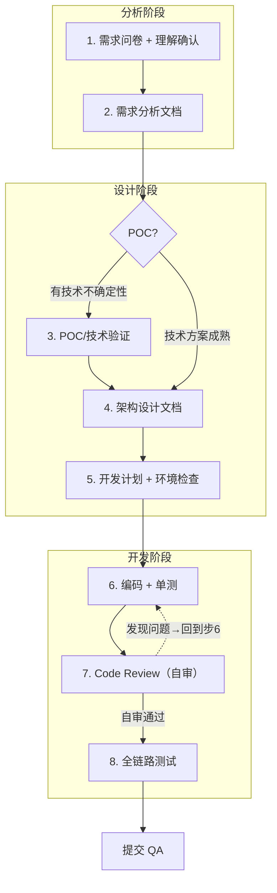

# AI Coding Workflow 规范

## 1. 背景与定位

AI 辅助编码场景下，业界存在三种主流工作流模式：

| 模式 | 约束方式 | 优势 | 劣势 | 适用场景 |
|------|----------|------|------|----------|
| Spec-Kit / Kiro 原生 | 工具+文件+步骤三重硬约束 | 防跳步、防幻觉、新手友好 | 繁琐、死板、小迭代内耗大 | 新手、纯AI开发、无自研流程 |
| 自研流程（现有流程） | 无强制约束，全靠人 | 极度灵活高效 | 依赖个人自律，AI易跳步乱写 | 资深开发者独立作业 |
| **自研流程 + Agent规则强约束** | 人保留灵活，AI被规则锁死 | 可控+灵活+不臃肿 | 需维护规则 | **资深开发者 + AI协作（推荐）** |

**核心原则：人定架构、人控边界、AI只做落地。**

其中 Spec-Kit / Kiro 原生流程的强制步骤为：宪法（steering）→ spec → 设计 → 任务 → 编码，每步必须完成才能进入下一步。

## 2. 推荐方案

采用「自研精简流程 + Agent 全局规则强约束 + 人工弹性豁免」模式：

- **人（开发者）**：保留灵活决策权，小改动可自行判断豁免，不被流程卡死
- **AI（Agent）**：被全局规则硬约束，严禁跳步、严禁先写代码、严禁改架构不留痕
- **文档体系**：需求文档 + 架构文档 + 开发计划，三层收敛，集中管理

**整体采用 AI-SDD（AI-assisted Software Design & Development）模式**：文档是流程门禁，关键决策先落文档，代码只是文档的实现；未过文档关不能进下一步。

## 3. 现有工作流



1. **需求问卷** → 锁定用户真实诉求、边界、约束。问卷完成后、生成需求文档前，AI 必须先输出 3 句话理解摘要（做什么、怎么做、不做什么），用户确认后再生成完整文档；遇到有歧义的技术术语时，必须列出多种解释让用户选择
2. **需求分析文档** → 固化 PRD / 需求范围、验收标准
3. **POC/技术验证**（条件触发）→ 存在未验证的技术假设、新技术栈引入、AI 推荐方案无实际经验时必须执行；技术方案成熟则跳过
4. **架构设计文档** → 技术方案、模块、依赖、存储、接口
5. **开发计划文档** → 任务拆解、排期、进度、风险、变更。计划完成后、编码前，必须根据架构设计文档确认所需工具链、SDK、运行环境是否就绪，识别阻塞项和非阻塞项；有阻塞项必须先解决再进入编码
6. **编码 + 单测** → 边写边测，保证函数/模块级正确性
7. **Code Review（自审）** → 基于统一 Code Review 规范，开发自行审查代码修改
   - 步骤 6↔7 循环迭代：自审发现问题则回到编码修改并补充测试，直到自审通过
8. **全链路测试** → 开发自己跑通完整业务流程，确认没问题再提交 QA

全程所有变更、进展、问题，统一更新开发计划文档。

## 4. Agent 全局规则模板

可直接复制到 Agent 全局规则（如 `.amazonq/rules/` 或 Kiro `steering.md`）：

```text
【强制研发流程约束，任何场景必须遵守，禁止跳过、禁止简化】

1. 接到需求/开发任务后，优先通过「需求问卷」锁定用户真实诉求、边界、约束。问卷完成后、生成需求文档前，必须先输出 3 句话理解摘要（做什么、怎么做、不做什么），用户确认后再生成完整文档。遇到有歧义的技术术语时，必须列出多种解释让用户选择。
2. 基于问卷结果，完善、核对「需求分析文档」，明确边界、规则、验收标准。
3. 存在未验证的技术假设、新技术栈引入、AI 推荐方案无实际经验时，必须先执行 POC/技术验证；技术方案成熟则跳过。
4. 涉及模块、数据库、接口、核心逻辑变更，必须先更新「架构设计文档」，产出方案后再进入开发。
5. 所有任务拆解、进度跟进、问题阻塞、迭代变更，统一维护更新「开发计划文档」。严禁直接编写业务代码、核心配置、表结构；未完成前置文档更新前，禁止编码。计划完成后、编码前，必须根据架构设计文档确认所需工具链、SDK、运行环境是否就绪，识别阻塞项和非阻塞项。有阻塞项必须先解决再进入编码。
6. 开发阶段必须伴随单元测试，保证函数/模块级正确性。
7. 单测通过后，必须基于统一 Code Review 规范对代码修改执行自审，聚焦设计合理性、规范一致性、安全隐患；自审发现问题须回到步骤 6 修改并补充测试，循环直到自审通过。
8. Code Review 自审通过后，执行全链路测试，确认业务流程跑通再提交 QA。
9. 变更分级与文档豁免：
    - 微小（≤3 文件，不涉及新接口/新模块）→ 仅更新开发计划文档，豁免架构/需求文档
    - 中等（新增接口、模块内重构、新增配置项）→ 更新开发计划 + 架构文档相关章节
    - 重大（新增模块、架构变更、技术栈变更）→ 全链路文档更新，禁止豁免
10. 所有代码修改必须对齐最新版需求文档、架构文档，保证文档与代码唯一一致。
11. 代码变更后，相关文档必须按以下矩阵同步更新，禁止文档脱节：
    - Bug 修复 → 仅更新开发计划文档
    - 接口/模块变更 → 更新架构设计文档 + 开发计划文档
    - 新增功能 → 更新需求分析文档 + 架构设计文档 + 开发计划文档
    - 技术栈变更 → 全链路文档更新（需求 + 架构 + 开发计划 + 已有代码中的相关注释）
```

## 5. 配套文档模板

各步骤引用的模板和规范，统一存放在 `docs/standards/` 目录：

| 流程步骤 | 配套模板/规范 | 路径 |
|----------|----------------|------|
| 1. 需求问卷 | 需求问卷模板 | `requirements-questionnaire-template.md` |
| 2. 需求分析文档 | 需求分析模板 | `requirements-analysis-template-chinese.md` |
| 4. 架构设计文档 | 架构设计模板 | `architecture-design-template-chinese.md` |
| 4. 迭代设计文档 | 迭代设计模板（无架构变更时替代架构文档） | `iteration-design-template-chinese.md` |
| 5. 开发计划文档 | 开发计划模板 | `development-plan-template-chinese.md` |
| 7. Code Review（自审） | 技术评审检查清单 | `Technical_Review_Checklist_CN.md` |

> 注：步骤 3（POC）、步骤 6（编码）、步骤 8（全链路测试）无固定模板，按项目实际情况组织。

## 6. 取舍与裁剪建议

### 6.1 工作流框架选择

根据团队模式选择工作流框架：

| 场景 | 推荐方案 | 理由 |
|------|----------|------|
| 单人开发、全权把控 | 本方案 | Spec-Kit/Kiro 原生流程是累赘 |
| 带新人、团队协作、多人接手 | 本方案 + 加严规则 | 或引入 Spec-Kit 级强约束 |
| 纯 AI 重度编码 | Spec-Kit/Kiro 原生流程 | 防止 AI 幻觉和架构失控 |

### 6.2 流程裁剪策略

确定使用本方案后，根据项目阶段裁剪流程：

| 场景 | 裁剪规则 |
|------|----------|
| 新建项目 | 完整执行步骤 1～8，不豁免 |
| 迭代开发（无架构变更） | 简化需求问卷（仅采集增量变更），跳过架构文档，基于迭代设计模板（`iteration-design-template-chinese.md`）产出本版本设计文档 |
| 迭代开发（有架构变更） | 先更新架构文档，再出迭代设计文档，其余流程不变 |
| 紧急 hotfix | 最小流程：开发计划记录 + 编码 + Code Review 自审，上线后 24 小时内补齐需求/架构文档 |

> 迭代开发的文档分层是行业主流实践：Atlassian 用 ADR（Architecture Decision Records）作为架构基线，每个 Sprint 出独立的 Technical Design Doc；Google 的 Design Doc 按功能/变更粒度产出，不是每次都改总体架构文档；敏捷/Scrum 中架构文档属于“演进式架构”，只在架构决策变更时更新。
