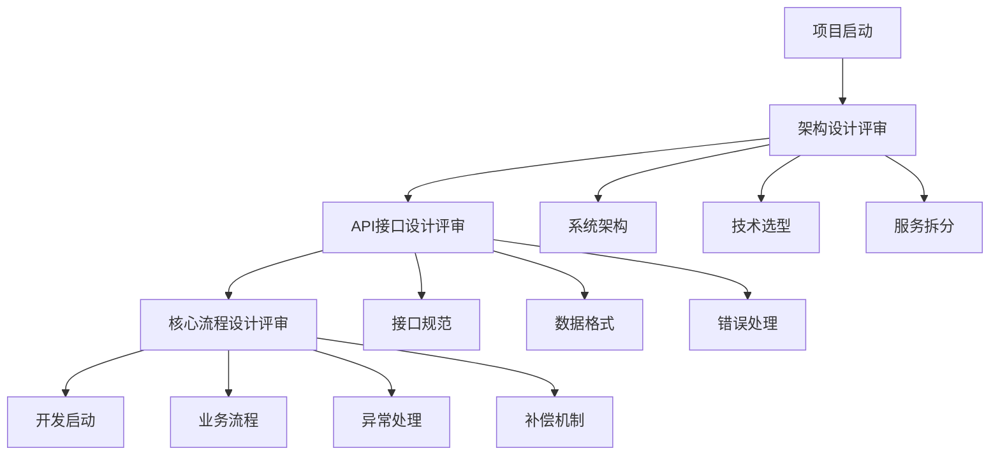
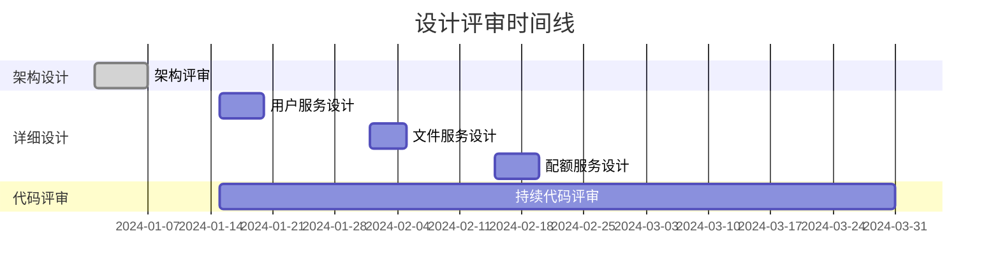

# 设计评审时机指南

## 概述

本文档总结了软件开发过程中不同类型设计的评审时机，帮助团队合理安排评审节点，提高开发效率和质量。

## 设计分类与评审时机

### 🏗️ 架构设计 vs 详细设计

| 设计类型 | 抽象层次 | 关注点 | 目标读者 |
|----------|----------|--------|----------|
| **架构设计** | 系统级、服务级 | 整体结构、技术选型、服务拆分 | 技术团队、产品、管理层 |
| **详细设计** | 类级、方法级 | 具体实现、算法、数据结构 | 开发团队 |

## 📅 评审时机安排

### 1. 开发启动前（必须完成）

#### ✅ 架构设计评审
- **系统整体架构**：分层结构、服务拆分、技术选型
- **核心业务流程**：关键业务流程的时序图和异常处理
- **API接口设计**：服务间接口定义、数据格式规范
- **安全架构**：认证授权、数据加密、威胁防护
- **部署架构**：环境规划、容器化策略、CI/CD流程

**评审目标**：
- 确保技术方向正确
- 识别系统性风险
- 统一技术标准
- 获得管理层支持

### 2. 开发过程中（推荐进行）

#### 🔄 详细设计评审
- **模块详细设计**：具体类设计、设计模式应用
- **数据库设计**：表结构、索引策略、分库分表
- **复杂业务逻辑**：状态机、规则引擎、算法实现
- **性能优化设计**：缓存策略、查询优化、并发控制

**评审节点**：
```markdown
Sprint计划阶段：
├── Sprint 1: 用户服务详细设计评审
├── Sprint 2: 文件服务详细设计评审
├── Sprint 3: 配额服务详细设计评审
└── 持续优化和重构评审
```

### 3. 代码评审时（持续进行）

#### 📝 实现质量评审
- **设计模式应用**：通过Code Review验证设计质量
- **代码架构一致性**：确保实现符合架构设计
- **重构决策**：基于实际编码经验优化设计
- **性能和安全**：代码层面的性能和安全检查

## 🎯 分层评审策略

### 开发启动前的必要评审



### 开发过程中的渐进评审



## 📋 评审检查点

### 架构设计评审检查清单

- [ ] **业务需求**：需求理解准确，边界清晰
- [ ] **技术选型**：选型合理，有明确理由
- [ ] **系统架构**：分层清晰，职责分离
- [ ] **服务拆分**：高内聚低耦合，边界明确
- [ ] **数据架构**：模型合理，扩展性好
- [ ] **安全设计**：威胁识别，防护措施完整
- [ ] **性能规划**：指标明确，容量合理
- [ ] **部署方案**：环境规划，自动化程度高

### 详细设计评审检查清单

- [ ] **类设计**：职责单一，接口清晰
- [ ] **算法选择**：复杂度合理，性能可接受
- [ ] **数据结构**：存储效率高，访问模式匹配
- [ ] **异常处理**：覆盖全面，恢复机制完善
- [ ] **并发安全**：线程安全，死锁预防
- [ ] **测试设计**：用例覆盖，边界条件考虑

## 💡 最佳实践建议

### 1. 评审时机选择
- **架构设计**：项目启动前必须完成，为开发提供指导
- **详细设计**：可以在开发过程中进行，支持敏捷迭代
- **代码评审**：持续进行，确保实现质量

### 2. 评审参与者
```markdown
架构设计评审：
├── 技术负责人（必须）
├── 资深开发工程师（必须）
├── 产品经理（推荐）
├── 运维工程师（推荐）
└── 安全工程师（如涉及安全）

详细设计评审：
├── 模块负责人（必须）
├── 相关开发工程师（必须）
├── 测试工程师（推荐）
└── 技术负责人（重要模块）
```

### 3. 评审输出
- **评审记录**：问题清单、决策记录、行动计划
- **设计文档**：更新后的设计文档
- **开发指导**：具体的开发规范和注意事项

## 🚀 敏捷开发适配

### 传统瀑布模式的问题
- ❌ 过度设计，包含不必要细节
- ❌ 变更成本高，文档返工量大
- ❌ 延迟交付，等待完整设计
- ❌ 脱离实际，纸面与实现差异

### 敏捷模式的优势
- ✅ 及时反馈，快速发现问题
- ✅ 渐进完善，设计更加准确
- ✅ 减少浪费，只设计必要部分
- ✅ 快速迭代，支持持续交付

## 📊 评审效果度量

### 质量指标
- **缺陷密度**：生产环境缺陷数量
- **重构频率**：架构调整和重构次数
- **开发效率**：功能交付速度和质量
- **技术债务**：代码质量和维护成本

### 过程指标
- **评审覆盖率**：设计评审的完成情况
- **问题发现率**：评审中发现的问题数量
- **解决及时性**：问题修复的响应时间
- **团队满意度**：开发团队对评审过程的反馈

---

**总结**：架构设计是"地基"，必须在开发前完成；详细设计是"装修"，可以边建边设计。这种分层评审策略既保证了系统的整体稳定性，又保持了开发的灵活性和效率。