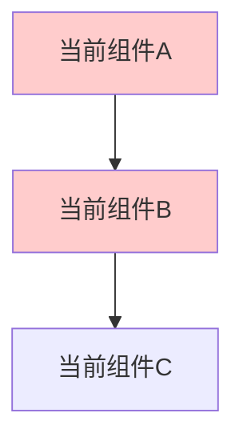
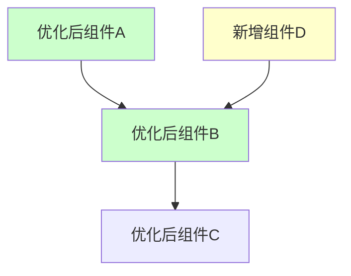
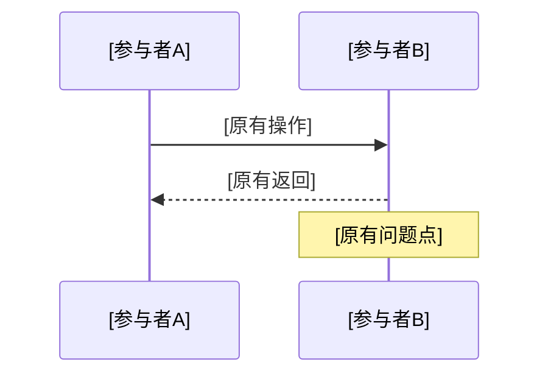
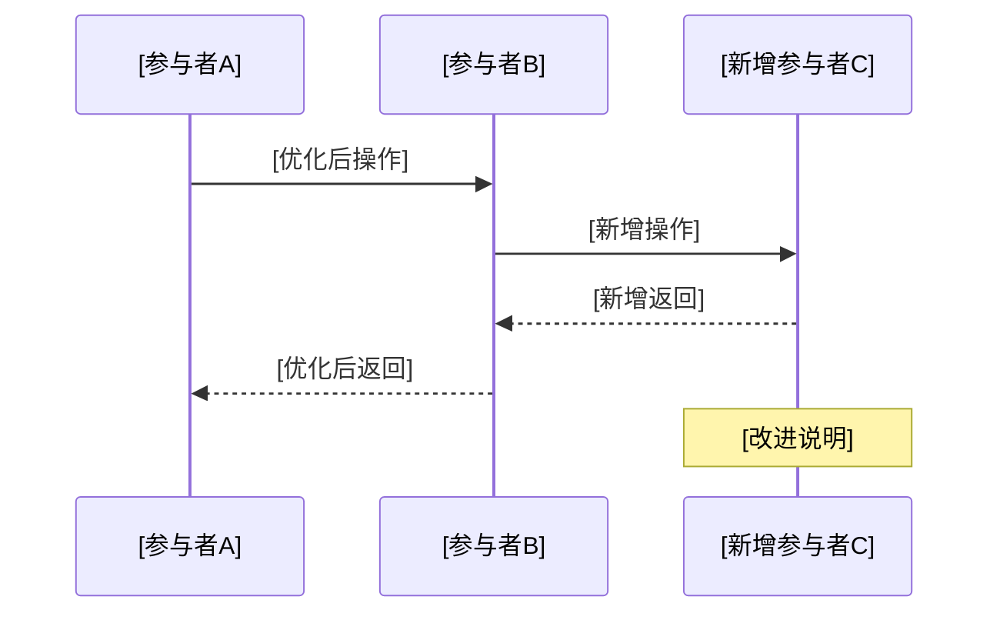

# 版本迭代设计文档模板

<!-- 模板使用说明 -->
<!-- 
📋 使用指南：
1. 替换所有 [占位符] 为具体内容
2. 删除不适用的章节和条件性内容
3. 删除所有以 <!-- 开头的注释行
4. 根据迭代类型选择对应章节：
   - 功能增加/修改：保留 2.2.1 功能设计
   - 性能优化：保留 2.2.2 性能优化设计  
   - 重构优化：保留 2.2.3 重构设计
5. 可选章节说明：
   - 第5章：复杂迭代需要详细规划时使用
   - 第6章：性能优化、重要功能变更需要重点监控时使用
   - 第7章：需要总结收益和规划后续工作时使用
   - 附录：根据实际需要添加
-->

**文档版本**: v1.0  
**创建日期**: [YYYY-MM-DD]  
**文档状态**: [草案/待评审/已批准]  
**迭代版本**: [v1.x.x]  
**迭代类型**: [功能增加/功能修改/性能优化/重构优化]  
**目标读者**: 技术团队、产品团队、测试团队  
**评审类型**: 版本迭代技术评审  

## 执行摘要

<!-- 本次迭代的核心价值和关键变更，控制在80字以内 -->
[本次迭代解决的核心问题 + 主要技术变更 + 预期收益]

## 1. 迭代背景与目标

### 1.1 迭代驱动因素

<!-- 功能类迭代选择业务驱动，优化类迭代选择技术驱动 -->
**业务驱动**:
- [用户需求变化]
- [市场竞争要求]
- [业务指标提升需求]

**技术驱动**:
- [性能瓶颈问题]
- [技术债务清理]
- [架构演进需求]
- [安全合规要求]

### 1.2 现状分析

**当前系统状态**:
- [关键指标1]: [当前值] (目标: [目标值])
- [关键指标2]: [当前值] (目标: [目标值])
- [关键指标3]: [当前值] (目标: [目标值])

**存在问题**:
- [问题1] [影响范围和严重程度]
- [问题2] [影响范围和严重程度]

### 1.3 迭代目标

**主要目标**:
1. [目标1] [具体指标和验收标准]
2. [目标2] [具体指标和验收标准]
3. [目标3] [具体指标和验收标准]

**成功标准**:
- [验收标准1]
- [验收标准2]
- [验收标准3]

## 2. 变更设计

### 2.1 变更范围

**涉及组件**:
- [组件1] [变更类型: 新增/修改/删除/优化]
- [组件2] [变更类型: 新增/修改/删除/优化]
- [组件3] [变更类型: 新增/修改/删除/优化]

**不涉及组件**:
- [明确不变更的组件，避免误解]

### 2.2 技术方案

<!-- 根据迭代类型选择对应章节，删除不适用的章节 -->
#### 2.2.1 功能设计

**新增功能**:
- [功能1] [功能描述和实现方式]
- [功能2] [功能描述和实现方式]

**修改功能**:
- [功能1] [修改内容和影响范围]
- [功能2] [修改内容和影响范围]

**接口变更**:
```yaml
# 新增接口
POST /api/v1/[resource]
  summary: [接口描述]
  parameters:
    - name: [参数名]
      type: [数据类型]
      required: [true/false]

# 修改接口 (如有)
PUT /api/v1/[resource]/{id}
  summary: [修改说明]
  # 变更内容说明
```

#### 2.2.2 性能优化设计

**优化目标**:
- [性能指标1]: 从 [当前值] 提升到 [目标值]
- [性能指标2]: 从 [当前值] 提升到 [目标值]

**优化策略**:
- [策略1] [具体实现方法]
- [策略2] [具体实现方法]
- [策略3] [具体实现方法]

**资源优化**:
- [CPU优化] [具体措施]
- [内存优化] [具体措施]
- [I/O优化] [具体措施]

#### 2.2.3 重构设计

**重构目标**:
- [代码质量提升]
- [架构优化]
- [技术债务清理]

**重构范围**:
- [模块1] [重构内容和理由]
- [模块2] [重构内容和理由]

**重构策略**:
- [策略1] [具体实施方法]
- [策略2] [具体实施方法]

### 2.3 架构变更

#### 2.3.1 变更前架构


#### 2.3.2 变更后架构


#### 2.3.3 关键变更说明
- [变更1] [变更原因和预期效果]
- [变更2] [变更原因和预期效果]
- [变更3] [变更原因和预期效果]

### 2.4 数据变更

#### 2.4.1 数据模型变更
```sql
-- 新增表/字段
ALTER TABLE [表名] ADD COLUMN [字段名] [数据类型] [约束];

-- 修改表结构
ALTER TABLE [表名] MODIFY COLUMN [字段名] [新数据类型];

-- 新增索引
CREATE INDEX [索引名] ON [表名] ([字段列表]);
```

#### 2.4.2 数据迁移策略
- [迁移步骤1] [具体操作和验证方法]
- [迁移步骤2] [具体操作和验证方法]
- [回滚方案] [数据回滚的具体步骤]

## 3. 关键流程变更

### 3.1 [变更流程1名称]

#### 3.1.1 变更前流程


#### 3.1.2 变更后流程


#### 3.1.3 改进效果
- [改进点1] [具体效果]
- [改进点2] [具体效果]

### 3.2 [变更流程2名称]
[按需添加其他关键流程变更]

## 4. 兼容性与风险分析

### 4.1 兼容性评估

| 兼容性类型 | 影响评估 | 保证措施 | 验证方法 |
|------------|----------|----------|----------|
| API兼容性 | [影响程度] | [保证措施] | [验证方法] |
| 数据兼容性 | [影响程度] | [保证措施] | [验证方法] |
| 客户端兼容性 | [影响程度] | [保证措施] | [验证方法] |

### 4.2 风险识别与控制

| 风险类型 | 风险描述 | 影响程度 | 预防措施 | 应急预案 |
|----------|----------|----------|----------|----------|
| [技术风险] | [风险描述] | [高/中/低] | [预防措施] | [应急预案] |
| [业务风险] | [风险描述] | [高/中/低] | [预防措施] | [应急预案] |
| [运维风险] | [风险描述] | [高/中/低] | [预防措施] | [应急预案] |

### 4.3 回滚策略

**回滚触发条件**:
- [条件1] [具体指标阈值]
- [条件2] [具体指标阈值]

**回滚步骤**:
1. [步骤1] [具体操作]
2. [步骤2] [具体操作]
3. [步骤3] [具体操作]

**回滚验证**:
- [验证项1] [验证方法]
- [验证项2] [验证方法]

## 5. 实施计划

<!-- 此章节适用于需要详细规划的复杂迭代，简单功能修改可删除 -->
### 5.1 开发计划

| 阶段 | 任务 | 负责人 | 开始时间 | 结束时间 | 交付物 |
|------|------|--------|----------|----------|---------|
| 开发阶段 | [开发任务] | [负责人] | [日期] | [日期] | [交付物] |
| 测试阶段 | [测试任务] | [负责人] | [日期] | [日期] | [交付物] |
| 发布阶段 | [发布任务] | [负责人] | [日期] | [日期] | [交付物] |

### 5.2 测试策略

**测试范围**:
- [功能测试] [测试重点]
- [性能测试] [测试指标]
- [兼容性测试] [测试场景]
- [回归测试] [测试范围]

**测试环境**:
- [开发环境] [环境配置]
- [测试环境] [环境配置]
- [预发布环境] [环境配置]

### 5.3 发布策略

**发布方式**:
- [灰度发布] [发布比例和策略]
- [蓝绿部署] [切换策略]
- [滚动更新] [更新策略]

**发布检查点**:
- [检查点1] [检查内容和标准]
- [检查点2] [检查内容和标准]
- [检查点3] [检查内容和标准]

## 6. 监控与验证

<!-- 此章节适用于性能优化、重要功能变更等需要重点监控的迭代 -->
### 6.1 关键指标监控

| 指标类型 | 指标名称 | 当前值 | 目标值 | 监控方式 |
|----------|----------|--------|--------|----------|
| 业务指标 | [指标1] | [当前值] | [目标值] | [监控工具] |
| 技术指标 | [指标2] | [当前值] | [目标值] | [监控工具] |
| 用户体验 | [指标3] | [当前值] | [目标值] | [监控工具] |

### 6.2 告警配置

| 告警类型 | 触发条件 | 告警级别 | 处理方式 |
|----------|----------|----------|----------|
| [业务告警] | [触发条件] | [严重/警告/提醒] | [处理流程] |
| [性能告警] | [触发条件] | [严重/警告/提醒] | [处理流程] |
| [错误告警] | [触发条件] | [严重/警告/提醒] | [处理流程] |

### 6.3 验收标准

**功能验收**:
- [验收项1] [验收标准]
- [验收项2] [验收标准]

**性能验收**:
- [性能指标1] [验收标准]
- [性能指标2] [验收标准]

**稳定性验收**:
- [稳定性指标1] [验收标准]
- [稳定性指标2] [验收标准]

## 7. 总结与后续规划

<!-- 此章节适用于需要总结收益和规划后续工作的迭代 -->
### 7.1 预期收益

**业务收益**:
- [收益1] [具体数值和计算方法]
- [收益2] [具体数值和计算方法]

**技术收益**:
- [收益1] [具体改进效果]
- [收益2] [具体改进效果]

### 7.2 后续规划

**短期规划** (1-3个月):
- [规划1] [具体内容]
- [规划2] [具体内容]

**中期规划** (3-6个月):
- [规划1] [具体内容]
- [规划2] [具体内容]

### 7.3 经验总结

**成功经验**:
- [经验1] [具体描述]
- [经验2] [具体描述]

**改进建议**:
- [建议1] [具体内容]
- [建议2] [具体内容]

---

## 附录

<!-- 以下附录章节为可选内容，根据实际需要添加 -->
### A. 相关文档
- [架构设计文档] [链接]
- [API文档] [链接]
- [运维手册] [链接]

### B. 技术调研
- [调研报告1] [链接或摘要]
- [调研报告2] [链接或摘要]

### C. 变更记录
| 版本 | 日期 | 变更内容 | 变更人 |
|------|------|----------|--------|
| v1.0 | [日期] | [初始版本] | [姓名] |
| v1.1 | [日期] | [变更内容] | [姓名] |